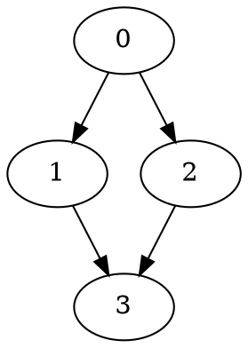
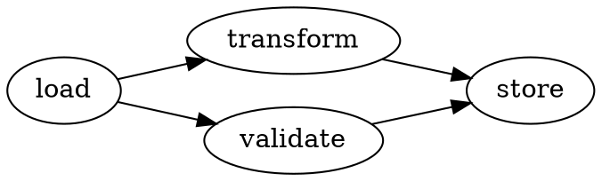
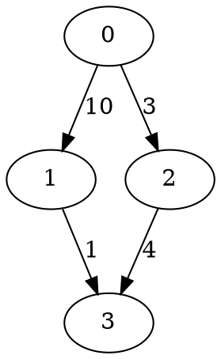

# CT-DP Graph Library — User Guide & Examples

**Andrew Drakeford · February 2026 · CT-DP v0.8**

---

## Prerequisites

A C++20 compiler: GCC 13+, Clang 17+, or MSVC 19.36+. The library is header-only with no external dependencies.

## Building

```bash
git clone https://github.com/andyD123-DR3/tuple_algebra.git
cd tuple_algebra
mkdir build && cd build
cmake .. -DCMAKE_BUILD_TYPE=Release
cmake --build . -j$(nproc)
ctest   # 536 tests
```

For standalone files without CMake:

```bash
g++ -std=c++20 -O2 -I include -o my_program my_program.cpp
```

## CMake Integration

```cmake
add_subdirectory(tuple_algebra)
target_link_libraries(my_target PRIVATE ctdp_graph)
```

All graph headers are then available as `#include <ctdp/graph/...>`.

---

## Part I — Core Graph Operations

### 1. Building a Graph (Compile-Time)

Every graph starts with a builder. The builder accumulates nodes and edges, then `finalise()` produces an immutable, canonicalised graph. The entire process can happen at compile time.

```cpp
#include <ctdp/graph/constexpr_graph.h>
#include <ctdp/graph/graph_builder.h>
#include <ctdp/graph/topological_sort.h>

using namespace ctdp::graph;

// A four-stage computation pipeline with a fork-join pattern:
//
//   load → transform ─┐
//     └──→ validate  ─┴→ store
//
constexpr auto make_pipeline() {
    graph_builder<8, 16> b;
    auto load      = b.add_node();   // 0
    auto transform = b.add_node();   // 1
    auto validate  = b.add_node();   // 2
    auto store     = b.add_node();   // 3
    b.add_edge(load, transform);
    b.add_edge(load, validate);
    b.add_edge(transform, store);
    b.add_edge(validate, store);
    return b.finalise();
}

constexpr auto g    = make_pipeline();
constexpr auto topo = topological_sort(g);

static_assert(g.node_count() == 4);
static_assert(g.edge_count() == 4);
static_assert(topo.is_dag);
static_assert(topo.order[0] == node_id{0});   // load executes first
static_assert(topo.order[3] == node_id{3});   // store executes last

int main() { return 0; }   // all checks passed at compile time
```

**Key points:**

- `graph_builder<MaxV, MaxE>` — capacity bounds, not sizes. A `<8, 16>` builder can hold up to 8 nodes and 16 edges.
- `add_node()` returns a `node_id`. `add_edge()` takes two `node_id`s.
- `finalise()` sorts edges by (src, dst), removes duplicates and self-edges, returns an immutable `constexpr_graph`.
- All algorithms return result structs inspectable with `static_assert`.

### 2. Building a Graph (Runtime)

When graph structure comes from external data — files, network messages, user input — use `runtime_graph`. It shares the same algorithms and result types.

```cpp
#include <ctdp/graph/runtime_graph.h>
#include <ctdp/graph/topological_sort.h>
#include <ctdp/graph/connected_components.h>
#include <iostream>
#include <vector>
#include <utility>

using namespace ctdp::graph;

int main() {
    // Edges arriving from external data (e.g. a task scheduler)
    std::vector<std::pair<int, int>> edges = {
        {0, 1}, {0, 2}, {1, 3}, {2, 3}, {3, 4}
    };
    int num_nodes = 5;

    runtime_graph_builder<64, 256> b;
    for (int i = 0; i < num_nodes; ++i) (void)b.add_node();
    for (auto [u, v] : edges)
        b.add_edge(node_id{static_cast<uint16_t>(u)},
                   node_id{static_cast<uint16_t>(v)});

    auto g = b.finalise();

    auto topo = topological_sort(g);
    std::cout << "Is DAG: " << (topo.is_dag ? "yes" : "no") << "\n";
    std::cout << "Execution order: ";
    for (std::size_t i = 0; i < topo.order.size(); ++i)
        std::cout << topo.order[i].value << " ";
    std::cout << "\n";

    auto cc = connected_components(g);
    std::cout << "Connected components: " << cc.component_count << "\n";
}
```

### 3. Querying Graph Structure

```cpp
#include <ctdp/graph/constexpr_graph.h>
#include <ctdp/graph/graph_builder.h>
#include <iostream>

using namespace ctdp::graph;

constexpr auto g = []() {
    graph_builder<8, 16> b;
    auto a = b.add_node(); auto bb = b.add_node();
    auto c = b.add_node(); auto d  = b.add_node();
    b.add_edge(a, bb); b.add_edge(a, c);
    b.add_edge(bb, d); b.add_edge(c, d);
    return b.finalise();
}();

int main() {
    std::cout << "Nodes: " << g.node_count()
              << "  Edges: " << g.edge_count() << "\n";

    for (std::size_t v = 0; v < g.node_count(); ++v) {
        auto id = node_id{static_cast<std::uint16_t>(v)};
        std::cout << "Node " << v << " → ";
        for (auto nb : g.out_neighbors(id))
            std::cout << nb.value << " ";
        std::cout << "(degree " << g.out_degree(id) << ")\n";
    }
}
```

Output:
```
Nodes: 4  Edges: 4
Node 0 → 1 2 (degree 2)
Node 1 → 3 (degree 1)
Node 2 → 3 (degree 1)
Node 3 → (degree 0)
```

### 4. Constexpr/Runtime Parity

The same graph built at compile time and runtime produces identical results. Prototype at compile time with `static_assert`, then switch to runtime when graphs come from external data.

```cpp
#include <ctdp/graph/constexpr_graph.h>
#include <ctdp/graph/graph_builder.h>
#include <ctdp/graph/runtime_graph.h>
#include <ctdp/graph/topological_sort.h>
#include <cassert>

using namespace ctdp::graph;

constexpr auto ct_graph = []() {
    graph_builder<8, 16> b;
    auto n0 = b.add_node(); auto n1 = b.add_node();
    auto n2 = b.add_node(); auto n3 = b.add_node();
    b.add_edge(n0, n1); b.add_edge(n0, n2);
    b.add_edge(n1, n3); b.add_edge(n2, n3);
    return b.finalise();
}();

int main() {
    runtime_graph_builder<8, 16> b;
    auto n0 = b.add_node(); auto n1 = b.add_node();
    auto n2 = b.add_node(); auto n3 = b.add_node();
    b.add_edge(n0, n1); b.add_edge(n0, n2);
    b.add_edge(n1, n3); b.add_edge(n2, n3);
    auto rt_graph = b.finalise();

    constexpr auto ct_topo = topological_sort(ct_graph);
    auto           rt_topo = topological_sort(rt_graph);

    assert(ct_topo.is_dag == rt_topo.is_dag);
    for (std::size_t i = 0; i < ct_topo.order.size(); ++i)
        assert(ct_topo.order[i] == rt_topo.order[i]);
}
```

---

## Part II — Analysis Algorithms

### 5. Topological Sort — Execution Ordering

Topological sort gives a valid execution order for a DAG. This establishes which computations must complete before others can begin.

**Compile-time — proving a pipeline is acyclic:**

```cpp
#include <ctdp/graph/constexpr_graph.h>
#include <ctdp/graph/graph_builder.h>
#include <ctdp/graph/topological_sort.h>

using namespace ctdp::graph;

// Five-stage numerical pipeline:
//   read_input → compute_jacobian → factorise → solve → write_output
constexpr auto pipeline = []() {
    graph_builder<8, 16> b;
    for (int i = 0; i < 5; ++i) b.add_node();
    for (int i = 0; i < 4; ++i)
        b.add_edge(node_id{static_cast<uint16_t>(i)},
                   node_id{static_cast<uint16_t>(i + 1)});
    return b.finalise();
}();

constexpr auto topo = topological_sort(pipeline);
static_assert(topo.is_dag);               // compiler proves no circular dependency
static_assert(topo.order.size() == 5);
```

**Runtime — scheduling tasks from configuration:**

```cpp
#include <ctdp/graph/runtime_graph.h>
#include <ctdp/graph/topological_sort.h>
#include <iostream>

using namespace ctdp::graph;

int main() {
    runtime_graph_builder<64, 256> b;
    auto parse   = b.add_node();   // 0
    auto enrich  = b.add_node();   // 1
    auto risk    = b.add_node();   // 2
    auto persist = b.add_node();   // 3
    auto report  = b.add_node();   // 4

    b.add_edge(parse, enrich);
    b.add_edge(parse, risk);       // enrich and risk can run in parallel
    b.add_edge(enrich, persist);
    b.add_edge(risk, persist);
    b.add_edge(persist, report);

    auto g    = b.finalise();
    auto topo = topological_sort(g);

    if (!topo.is_dag) {
        std::cerr << "ERROR: circular dependency in task graph\n";
        return 1;
    }

    std::cout << "Execution order:\n";
    const char* names[] = {"parse", "enrich", "risk", "persist", "report"};
    for (std::size_t i = 0; i < topo.order.size(); ++i)
        std::cout << "  " << (i + 1) << ". " << names[topo.order[i].value] << "\n";
}
```

### 6. Connected Components — Finding Independent Subproblems

Connected components identify independent subgraphs that can be optimised or executed separately.

**Compile-time — partitioning a computation graph:**

```cpp
#include <ctdp/graph/constexpr_graph.h>
#include <ctdp/graph/graph_builder.h>
#include <ctdp/graph/connected_components.h>

using namespace ctdp::graph;

// Two independent subproblems:
//   Subproblem A: 0 → 1 → 2
//   Subproblem B: 3 → 4
constexpr auto g = []() {
    graph_builder<8, 16> b;
    for (int i = 0; i < 5; ++i) b.add_node();
    b.add_edge(node_id{0}, node_id{1});
    b.add_edge(node_id{1}, node_id{2});
    b.add_edge(node_id{3}, node_id{4});
    return b.finalise();
}();

constexpr auto cc = connected_components(g);
static_assert(cc.component_count == 2);
static_assert(cc.component_of[0] == cc.component_of[1]);  // 0,1,2 together
static_assert(cc.component_of[0] == cc.component_of[2]);
static_assert(cc.component_of[3] == cc.component_of[4]);  // 3,4 together
static_assert(cc.component_of[0] != cc.component_of[3]);  // separate
```

**Runtime — identifying independent sub-portfolios:**

```cpp
#include <ctdp/graph/runtime_graph.h>
#include <ctdp/graph/connected_components.h>
#include <iostream>

using namespace ctdp::graph;

int main() {
    runtime_graph_builder<64, 256> b;
    // Instruments with shared risk factors form connected components
    // Independent components can be valued on separate cores
    for (int i = 0; i < 8; ++i) b.add_node();
    b.add_edge(node_id{0}, node_id{1});   // group A
    b.add_edge(node_id{1}, node_id{2});
    b.add_edge(node_id{3}, node_id{4});   // group B
    b.add_edge(node_id{5}, node_id{6});   // group C
    b.add_edge(node_id{6}, node_id{7});

    auto g  = b.finalise();
    auto cc = connected_components(g);

    std::cout << "Found " << cc.component_count
              << " independent sub-portfolios\n";
    for (std::size_t v = 0; v < g.node_count(); ++v)
        std::cout << "  Instrument " << v
                  << " → portfolio " << cc.component_of[v] << "\n";
}
```

### 7. Strongly Connected Components — Detecting Cycles

SCC finds groups of mutually reachable nodes. In a dependency graph, any SCC with more than one node indicates a circular dependency.

**Compile-time — detecting feedback loops:**

```cpp
#include <ctdp/graph/constexpr_graph.h>
#include <ctdp/graph/graph_builder.h>
#include <ctdp/graph/scc.h>

using namespace ctdp::graph;

// DAG: every node is its own SCC
constexpr auto dag = []() {
    graph_builder<8, 16> b;
    auto a = b.add_node(); auto bb = b.add_node(); auto c = b.add_node();
    b.add_edge(a, bb); b.add_edge(bb, c);
    return b.finalise();
}();

constexpr auto sc_dag = scc(dag);
static_assert(sc_dag.component_count == 3);   // no cycles

// Graph with a cycle: 0 → 1 → 2 → 0
constexpr auto cyclic = []() {
    graph_builder<8, 16> b;
    auto a = b.add_node(); auto bb = b.add_node(); auto c = b.add_node();
    b.add_edge(a, bb); b.add_edge(bb, c); b.add_edge(c, a);
    return b.finalise();
}();

constexpr auto sc_cyc = scc(cyclic);
static_assert(sc_cyc.component_count == 1);   // all three form one SCC
```

**Runtime — finding circular dependencies in a build system:**

```cpp
#include <ctdp/graph/runtime_graph.h>
#include <ctdp/graph/scc.h>
#include <iostream>

using namespace ctdp::graph;

int main() {
    runtime_graph_builder<64, 256> b;
    auto core    = b.add_node();   // 0
    auto util    = b.add_node();   // 1
    auto app     = b.add_node();   // 2
    auto logging = b.add_node();   // 3

    b.add_edge(app, core);
    b.add_edge(app, util);
    b.add_edge(util, logging);
    b.add_edge(logging, util);     // circular: util ↔ logging

    auto g  = b.finalise();
    auto sc = scc(g);

    const char* names[] = {"core", "util", "app", "logging"};
    if (sc.component_count < g.node_count()) {
        std::cout << "WARNING: circular dependencies detected\n";
        for (std::size_t v = 0; v < g.node_count(); ++v)
            std::cout << "  " << names[v]
                      << " → SCC " << sc.component_of[v] << "\n";
    }
}
```

---

## Part III — Undirected Graphs

### 8. Graph Colouring — Parallel Execution Groups

Graph colouring assigns colours so no adjacent nodes share a colour. Same-colour nodes are independent and can execute in parallel.

**Compile-time — parallelising row updates in SpMV:**

```cpp
#include <ctdp/graph/symmetric_graph.h>
#include <ctdp/graph/graph_coloring.h>

using namespace ctdp::graph;

// Row conflict graph: rows that share nonzero columns conflict.
// Same-colour rows can be updated in parallel without data races.
constexpr auto conflict = []() {
    symmetric_graph_builder<8, 16> b;
    for (int i = 0; i < 6; ++i) b.add_node();
    b.add_edge(node_id{0}, node_id{1});
    b.add_edge(node_id{0}, node_id{2});
    b.add_edge(node_id{1}, node_id{3});
    b.add_edge(node_id{4}, node_id{5});
    return b.finalise();
}();

constexpr auto cr = graph_coloring(conflict);
static_assert(cr.verified);          // no adjacent pair shares a colour
```

**Runtime — building conflict graph from a sparse matrix:**

```cpp
#include <ctdp/graph/symmetric_graph.h>
#include <ctdp/graph/graph_coloring.h>
#include <iostream>
#include <vector>
#include <set>

using namespace ctdp::graph;

int main() {
    int nrows = 8;
    std::vector<std::set<int>> row_cols = {
        {0, 1, 2}, {1, 2, 3}, {2, 3, 4}, {4, 5},
        {5, 6},    {6, 7},    {0, 7},    {3, 6}
    };

    symmetric_graph_builder<16, 64> b;
    for (int i = 0; i < nrows; ++i) b.add_node();

    for (int i = 0; i < nrows; ++i)
        for (int j = i + 1; j < nrows; ++j) {
            for (int c : row_cols[i])
                if (row_cols[j].count(c)) {
                    b.add_edge(node_id{static_cast<uint16_t>(i)},
                               node_id{static_cast<uint16_t>(j)});
                    break;
                }
        }

    auto sg = b.finalise();
    auto cr = graph_coloring(sg);

    std::cout << "Colours needed: " << cr.color_count << "\n";
    for (int c = 0; c < static_cast<int>(cr.color_count); ++c) {
        std::cout << "  Parallel group " << c << ": rows ";
        for (int r = 0; r < nrows; ++r)
            if (cr.color_of[r] == static_cast<uint16_t>(c))
                std::cout << r << " ";
        std::cout << "\n";
    }
    std::cout << "Verified: " << (cr.verified ? "yes" : "no") << "\n";
}
```

### 9. Min Cut (Stoer–Wagner) — Communication Partitioning

The minimum cut finds the cheapest way to partition a graph into two parts — the lowest-cost communication boundary for distributing work across processors.

**Compile-time — proving partition quality:**

```cpp
#include <ctdp/graph/symmetric_graph.h>
#include <ctdp/graph/min_cut.h>

using namespace ctdp::graph;

// Two tightly-connected clusters joined by a thin bridge
constexpr auto cluster_graph = []() {
    symmetric_graph_builder<8, 16> b;
    for (int i = 0; i < 6; ++i) b.add_node();
    // Cluster A: {0,1,2}
    b.add_edge(node_id{0}, node_id{1});
    b.add_edge(node_id{1}, node_id{2});
    b.add_edge(node_id{0}, node_id{2});
    // Cluster B: {3,4,5}
    b.add_edge(node_id{3}, node_id{4});
    b.add_edge(node_id{4}, node_id{5});
    b.add_edge(node_id{3}, node_id{5});
    // Bridge
    b.add_edge(node_id{2}, node_id{3});
    return b.finalise();
}();

constexpr auto unit_weight = [](node_id, node_id) -> double { return 1.0; };
constexpr auto mc = stoer_wagner(cluster_graph, unit_weight);

static_assert(mc.verified);
static_assert(mc.has_cut);
static_assert(mc.cut_weight == 1.0);   // bridge is the bottleneck
```

**Runtime — partitioning a communication graph:**

```cpp
#include <ctdp/graph/symmetric_graph.h>
#include <ctdp/graph/min_cut.h>
#include <iostream>
#include <array>

using namespace ctdp::graph;

int main() {
    symmetric_graph_builder<16, 64> b;
    for (int i = 0; i < 6; ++i) b.add_node();

    struct Link { int u, v; double bytes; };
    Link links[] = {
        {0, 1, 1000}, {0, 2, 800},  {1, 2, 1200},   // cluster A
        {3, 4, 900},  {3, 5, 1100}, {4, 5, 950},     // cluster B
        {2, 3, 50}                                     // cross-cluster
    };

    for (auto& l : links)
        b.add_edge(node_id{static_cast<uint16_t>(l.u)},
                   node_id{static_cast<uint16_t>(l.v)});

    auto sg = b.finalise();

    std::array<std::array<double, 16>, 16> W{};
    for (auto& l : links) {
        W[l.u][l.v] = l.bytes;
        W[l.v][l.u] = l.bytes;
    }
    auto weight = [&W](node_id u, node_id v) -> double {
        return W[u.value][v.value];
    };

    auto mc = stoer_wagner(sg, weight);

    std::cout << "Min-cut communication cost: " << mc.cut_weight << " bytes\n";
    std::cout << "Partition:\n";
    for (std::size_t v = 0; v < sg.node_count(); ++v)
        std::cout << "  Task " << v << " → processor " << mc.partition[v] << "\n";
}
```

---

## Part IV — Weighted Graphs & Shortest Path

### 10. Dijkstra — Optimal Execution Path

Dijkstra finds the cheapest path through a weighted graph — the lowest-cost execution route through a computation graph.

**Compile-time — proving optimal plan selection:**

```cpp
#include <ctdp/graph/constexpr_graph.h>
#include <ctdp/graph/graph_builder.h>
#include <ctdp/graph/shortest_path.h>

using namespace ctdp::graph;

// Three alternative routes from data source to output:
//
//   source ──10──→ vectorised ──1──→ output
//   source ──3───→ scalar     ──4──→ output
//   source ──2───→ tiled      ──1──→ output   ← cheapest: cost 3
//
constexpr auto g = []() {
    graph_builder<8, 16> b;
    auto source     = b.add_node();   // 0
    auto vectorised = b.add_node();   // 1
    auto scalar     = b.add_node();   // 2
    auto tiled      = b.add_node();   // 3
    auto output     = b.add_node();   // 4
    b.add_edge(source, vectorised);
    b.add_edge(source, scalar);
    b.add_edge(source, tiled);
    b.add_edge(vectorised, output);
    b.add_edge(scalar, output);
    b.add_edge(tiled, output);
    return b.finalise();
}();

constexpr auto cost = [](node_id u, node_id v) -> double {
    if (u.value == 0 && v.value == 1) return 10.0;
    if (u.value == 0 && v.value == 2) return 3.0;
    if (u.value == 0 && v.value == 3) return 2.0;
    if (u.value == 1 && v.value == 4) return 1.0;
    if (u.value == 2 && v.value == 4) return 4.0;
    if (u.value == 3 && v.value == 4) return 1.0;
    return 0.0;
};

constexpr auto sp = dijkstra(g, node_id{0}, cost);
static_assert(sp.verified);
static_assert(sp.dist[4] == 3.0);    // cheapest: source → tiled → output
static_assert(sp.pred[4] == 3);      // output via tiled (node 3)
static_assert(sp.pred[3] == 0);      // tiled via source (node 0)
```

**Runtime — finding cheapest path with measured costs:**

```cpp
#include <ctdp/graph/runtime_graph.h>
#include <ctdp/graph/shortest_path.h>
#include <iostream>
#include <array>
#include <vector>

using namespace ctdp::graph;

int main() {
    runtime_graph_builder<32, 128> b;
    auto src   = b.add_node();   // 0: data source
    auto fft   = b.add_node();   // 1: FFT transform
    auto conv  = b.add_node();   // 2: direct convolution
    auto merge = b.add_node();   // 3: merge results
    auto sink  = b.add_node();   // 4: output

    b.add_edge(src, fft);
    b.add_edge(src, conv);
    b.add_edge(fft, merge);
    b.add_edge(conv, merge);
    b.add_edge(merge, sink);

    auto g = b.finalise();

    // Costs from runtime benchmarks (nanoseconds)
    std::array<std::array<double, 32>, 32> W{};
    W[0][1] = 150.0;   W[0][2] = 80.0;
    W[1][3] = 20.0;    W[2][3] = 45.0;
    W[3][4] = 10.0;

    auto cost_fn = [&W](node_id u, node_id v) -> double {
        return W[u.value][v.value];
    };

    auto sp = dijkstra(g, src, cost_fn);

    const char* names[] = {"source", "fft", "conv", "merge", "sink"};
    std::cout << "Costs from source:\n";
    for (std::size_t v = 0; v < g.node_count(); ++v)
        std::cout << "  " << names[v] << ": " << sp.dist[v] << " ns\n";

    // Reconstruct optimal path to sink
    std::cout << "\nOptimal path: ";
    std::vector<uint16_t> path;
    for (uint16_t cur = 4; cur != 0xFFFF; cur = sp.pred[cur])
        path.push_back(cur);
    for (auto it = path.rbegin(); it != path.rend(); ++it)
        std::cout << names[*it] << (*it != 4 ? " → " : "");
    std::cout << "\nTotal: " << sp.dist[4] << " ns\n";
}
```

---

## Part V — Bipartite Matching

### 11. Hopcroft–Karp — Optimal Assignment

Bipartite matching solves assignment problems: tasks to workers, operations to ALUs, data to cache lines.

**Compile-time — assigning operations to execution units:**

```cpp
#include <ctdp/graph/bipartite_graph.h>
#include <ctdp/graph/bipartite_matching.h>

using namespace ctdp::graph;

// 3 operations (left), 3 execution units (right)
constexpr auto assignment = []() {
    bipartite_graph_builder<4, 4, 16> b;
    auto op_add  = b.add_left();
    auto op_mul  = b.add_left();
    auto op_div  = b.add_left();

    auto alu0 = b.add_right();
    auto alu1 = b.add_right();
    auto fpu  = b.add_right();

    b.add_edge(op_add, alu0);       // add can run on ALU0
    b.add_edge(op_add, alu1);       // add can run on ALU1
    b.add_edge(op_mul, alu1);       // mul needs ALU1 or FPU
    b.add_edge(op_mul, fpu);
    b.add_edge(op_div, fpu);        // div needs FPU

    return b.finalise();
}();

constexpr auto match = bipartite_matching(assignment);
static_assert(match.matching_size == 3);   // all 3 operations assigned
static_assert(match.verified);
```

**Runtime — matching jobs to servers:**

```cpp
#include <ctdp/graph/bipartite_graph.h>
#include <ctdp/graph/bipartite_matching.h>
#include <iostream>

using namespace ctdp::graph;

int main() {
    bipartite_graph_builder<8, 8, 32> b;
    auto j0 = b.add_left();   auto j1 = b.add_left();
    auto j2 = b.add_left();   auto j3 = b.add_left();

    auto s0 = b.add_right();  auto s1 = b.add_right();
    auto s2 = b.add_right();

    b.add_edge(j0, s0); b.add_edge(j0, s1);
    b.add_edge(j1, s1); b.add_edge(j1, s2);
    b.add_edge(j2, s0);
    b.add_edge(j3, s2);

    auto bg    = b.finalise();
    auto match = bipartite_matching(bg);

    std::cout << "Maximum assignment: " << match.matching_size
              << " out of " << bg.left_count() << " jobs\n";
    std::cout << "Verified: " << (match.verified ? "yes" : "no") << "\n";
}
```

---

## Part VI — Fusion & Coarsening Pipeline

### 12. Kernel Fusion — Reducing Memory Traffic

The fusion pipeline identifies adjacent kernels that can be merged to eliminate intermediate memory traffic.

**Compile-time — fusing a linear pipeline:**

```cpp
#include <ctdp/graph/from_pipeline.h>
#include <ctdp/graph/topological_sort.h>

using namespace ctdp::graph;

// 5-stage pipeline: 0 → 1 → 2 → 3 → 4
constexpr auto g = from_pipeline<5>();
constexpr auto topo = topological_sort(g);
static_assert(topo.is_dag);

// In the full CT-DP pipeline:
//   1. fusion_legal() identifies fusable pairs (same kernel_tag, fusable flag)
//   2. find_fusion_groups() merges them into groups
//   3. coarsen() produces a reduced graph with super-nodes
//   The coarsened graph has fewer nodes → fewer memory round-trips
```

**Runtime — fusing a dynamically-constructed data flow:**

```cpp
#include <ctdp/graph/runtime_graph.h>
#include <ctdp/graph/topological_sort.h>
#include <iostream>

using namespace ctdp::graph;

int main() {
    runtime_graph_builder<64, 256> b;

    auto load    = b.add_node();   // 0: load from memory
    auto scale   = b.add_node();   // 1: elementwise scale
    auto bias    = b.add_node();   // 2: elementwise add bias
    auto relu    = b.add_node();   // 3: elementwise ReLU
    auto reduce  = b.add_node();   // 4: reduction (sum)
    auto store   = b.add_node();   // 5: store to memory

    b.add_edge(load, scale);
    b.add_edge(scale, bias);
    b.add_edge(bias, relu);        // scale→bias→relu: fusable chain
    b.add_edge(relu, reduce);
    b.add_edge(reduce, store);

    auto g    = b.finalise();
    auto topo = topological_sort(g);

    const char* names[] = {"load", "scale", "bias", "relu", "reduce", "store"};
    std::cout << "Pipeline (" << g.node_count() << " stages): ";
    for (std::size_t i = 0; i < topo.order.size(); ++i)
        std::cout << names[topo.order[i].value]
                  << (i + 1 < topo.order.size() ? " → " : "");
    std::cout << "\n";

    // After fusion: scale+bias+relu merge into one fused kernel
    // Reduces 6 stages to 4, eliminating 2 memory round-trips
}
```

---

## Part VII — Engine Bridge

### 13. Engine Type Aliases

For engine-level code, pre-defined type aliases at MaxV=64, MaxE=256:

```cpp
#include <ctdp/engine/bridge/graph_types.h>
using namespace ctdp::engine;

engine_graph          g;    // constexpr_graph<64, 256>
engine_rt_graph       rg;   // runtime_graph<64, 256>
engine_sym_graph      sg;   // symmetric_graph<64, 256>
engine_topo_result    tr;   // topo_result<64>
engine_coloring_result cr;  // coloring_result<64>
engine_sp_result      sp;   // shortest_path_result<64>
engine_min_cut_result mc;   // min_cut_result<64>
```

### 14. End-to-End: Graph → Space → Plan → Execution

The CT-DP optimisation workflow:

```cpp
#include <ctdp/graph/constexpr_graph.h>
#include <ctdp/graph/graph_builder.h>
#include <ctdp/graph/topological_sort.h>
#include <ctdp/graph/kernel_info.h>

using namespace ctdp::graph;

// 1. Build computation graph
constexpr auto g = []() {
    graph_builder<64, 256> b;
    auto read   = b.add_node();
    auto comp_a = b.add_node();
    auto comp_b = b.add_node();
    auto write  = b.add_node();
    b.add_edge(read, comp_a);
    b.add_edge(read, comp_b);
    b.add_edge(comp_a, write);
    b.add_edge(comp_b, write);
    return b.finalise();
}();

// 2. Verify structure
constexpr auto topo = topological_sort(g);
static_assert(topo.is_dag);

// 3. In the full pipeline:
//   auto kmap = make_kernel_map(g, ...);          // annotate with costs
//   auto space = build_schedule_space(g, kmap);    // enumerate configurations
//   auto constraints = build_constraints(g, kmap); // dependency/resource limits
//   auto plan = solve(space, cost_model, constraints);  // DP search
//   execute<plan>(input);                          // optimal compiled kernel
```

---

## Part VIII — Graph I/O & Visualisation

The library provides a unified text format with two entry points: a fully constexpr parser for string literals (and C++26 `#embed`), and runtime stream I/O for files. A DOT exporter produces Graphviz output for visualisation.

### 15. Text Format

The text format is deliberately simple — one line per declaration, comments with `#`, blank lines ignored:

```
# Diamond DAG
nodes 4
edge 0 1
edge 0 2
edge 1 3
edge 2 3
```

Weighted edges add a third field (ignored by the topology parser, available for weight-aware readers):

```
nodes 3
edge 0 1 10
edge 1 2 20
edge 0 2 5
```

Rules: `nodes N` must appear before any `edge` line. Self-edges are removed by the builder. Duplicate edges are deduplicated. Node indices are 0-based.

### 16. Capacity Policies

Instead of spelling `<MaxV, MaxE>` everywhere, capacity policies bundle the bounds into a single type:

```cpp
#include <ctdp/graph/graph_capacity.h>

using namespace ctdp::graph;

// Pre-defined tiers:
//   cap::small   — MaxV=16,  MaxE=64    (unit tests, toy examples)
//   cap::medium  — MaxV=64,  MaxE=256   (typical pipelines — the default)
//   cap::large   — MaxV=256, MaxE=1024  (stencils, large DAGs)

// Convenience aliases use policies:
directed_graph<cap::small>  g;      // = constexpr_graph<16, 64>
directed_builder<cap::medium> b;    // = graph_builder<64, 256>
symmetric_graph_alias<cap::large> sg;  // = symmetric_graph<256, 1024>

// Custom policy:
struct my_cap {
    static constexpr std::size_t max_v = 128;
    static constexpr std::size_t max_e = 512;
};
static_assert(capacity_policy<my_cap>);   // concept check
directed_graph<my_cap> custom_g;
```

### 17. Constexpr Parsing — Reading a Graph at Compile Time

The constexpr parser works with string literals today. In C++26, `#embed` will allow parsing graph files at compile time.

**Directed graph from a string literal:**

```cpp
#include <ctdp/graph/graph_io.h>
#include <ctdp/graph/topological_sort.h>

using namespace ctdp::graph;

// Parse a graph from text at compile time
constexpr auto g = io::parse_directed<cap::small>(
    "# A simple pipeline\n"
    "nodes 4\n"
    "edge 0 1\n"
    "edge 0 2\n"
    "edge 1 3\n"
    "edge 2 3\n");

static_assert(g.node_count() == 4);
static_assert(g.edge_count() == 4);

// Run algorithms on the parsed graph — still fully constexpr
constexpr auto topo = topological_sort(g);
static_assert(topo.is_dag);
static_assert(topo.order[0] == node_id{0});

int main() { return 0; }
```

**Symmetric (undirected) graph from text:**

```cpp
#include <ctdp/graph/graph_io.h>
#include <ctdp/graph/graph_coloring.h>

using namespace ctdp::graph;

// Each "edge u v" line creates both directions automatically
constexpr auto sg = io::parse_symmetric<cap::small>(
    "# Triangle\n"
    "nodes 3\n"
    "edge 0 1\n"
    "edge 1 2\n"
    "edge 0 2\n");

static_assert(sg.node_count() == 3);

constexpr auto cr = graph_coloring(sg);
static_assert(cr.verified);
static_assert(cr.color_count == 3);   // triangle needs 3 colours

int main() { return 0; }
```

**With weights (topology parsed, weights available for algorithms):**

```cpp
#include <ctdp/graph/graph_io.h>

using namespace ctdp::graph;

// Weights in the text format are parsed but not stored in the topology.
// The topology is what parse_directed returns.
constexpr auto g = io::parse_directed<cap::small>(
    "nodes 3\n"
    "edge 0 1 10\n"
    "edge 1 2 20\n"
    "edge 0 2 5\n");

static_assert(g.node_count() == 3);
static_assert(g.edge_count() == 3);
// Weights are supplied separately via a weight function for algorithms

int main() { return 0; }
```

**Error detection at compile time:**

Malformed input, capacity overflow, and missing `nodes` lines all produce compilation errors:

```cpp
// This fails at compile time with a clear diagnostic:
constexpr auto bad = io::parse_directed<cap::small>(
    "edge 0 1\n");   // ERROR: 'edge' before 'nodes'

constexpr auto overflow = io::parse_directed<cap::small>(
    "nodes 100\n");  // ERROR: node count exceeds capacity (cap::small max_v=16)
```

### 18. Runtime File I/O — Reading and Writing Graph Files

**Writing a graph to a file:**

```cpp
#include <ctdp/graph/graph_io.h>
#include <ctdp/graph/graph_builder.h>
#include <fstream>

using namespace ctdp::graph;

int main() {
    // Build a graph
    graph_builder<8, 16> b;
    auto n0 = b.add_node(); auto n1 = b.add_node();
    auto n2 = b.add_node(); auto n3 = b.add_node();
    b.add_edge(n0, n1); b.add_edge(n0, n2);
    b.add_edge(n1, n3); b.add_edge(n2, n3);
    auto g = b.finalise();

    // Write topology
    std::ofstream out("pipeline.graph");
    io::write(out, g);
    // Produces:
    //   nodes 4
    //   edge 0 1
    //   edge 0 2
    //   edge 1 3
    //   edge 2 3
}
```

**Writing with edge weights:**

```cpp
#include <ctdp/graph/graph_io.h>
#include <ctdp/graph/graph_builder.h>
#include <fstream>

using namespace ctdp::graph;

int main() {
    graph_builder<8, 16> b;
    auto n0 = b.add_node(); auto n1 = b.add_node();
    auto n2 = b.add_node();
    b.add_edge(n0, n1); b.add_edge(n1, n2); b.add_edge(n0, n2);
    auto g = b.finalise();

    auto weight = [](node_id u, node_id v) -> int {
        if (u.value == 0 && v.value == 1) return 10;
        if (u.value == 1 && v.value == 2) return 20;
        return 5;
    };

    std::ofstream out("weighted.graph");
    io::write(out, g, weight);
    // Produces:
    //   nodes 3
    //   edge 0 1 10
    //   edge 0 2 5
    //   edge 1 2 20
}
```

**Reading a graph from a file:**

```cpp
#include <ctdp/graph/graph_io.h>
#include <ctdp/graph/topological_sort.h>
#include <fstream>
#include <iostream>

using namespace ctdp::graph;

int main() {
    // Default capacity: MaxV=256, MaxE=1024
    std::ifstream in("pipeline.graph");
    auto g = io::read_directed(in);

    std::cout << "Loaded: " << g.node_count() << " nodes, "
              << g.edge_count() << " edges\n";

    auto topo = topological_sort(g);
    std::cout << "Is DAG: " << (topo.is_dag ? "yes" : "no") << "\n";
}
```

**Reading with a custom capacity policy:**

```cpp
#include <ctdp/graph/graph_io.h>
#include <fstream>

using namespace ctdp::graph;

int main() {
    // For small graphs, use a tighter policy to save stack space
    std::ifstream in("small.graph");
    auto g = io::read_directed(in, cap::small{});
    // g is constexpr_graph<16, 64>

    // For large problems
    std::ifstream big("stencil.graph");
    auto g2 = io::read_directed(big, cap::large{});
    // g2 is constexpr_graph<256, 1024>
}
```

**Write → read round-trip:**

```cpp
#include <ctdp/graph/graph_io.h>
#include <ctdp/graph/graph_builder.h>
#include <sstream>
#include <cassert>

using namespace ctdp::graph;

int main() {
    // Build original
    graph_builder<16, 64> b;
    auto n0 = b.add_node(); auto n1 = b.add_node();
    auto n2 = b.add_node(); auto n3 = b.add_node();
    b.add_edge(n0, n1); b.add_edge(n0, n2);
    b.add_edge(n1, n3); b.add_edge(n2, n3);
    auto original = b.finalise();

    // Write to string
    std::ostringstream oss;
    io::write(oss, original);

    // Read back
    std::istringstream iss(oss.str());
    auto restored = io::read_directed(iss);

    // Verify identical
    assert(restored.node_count() == original.node_count());
    assert(restored.edge_count() == original.edge_count());
    for (std::size_t u = 0; u < original.node_count(); ++u) {
        auto uid = node_id{static_cast<uint16_t>(u)};
        assert(original.out_neighbors(uid).size() ==
               restored.out_neighbors(uid).size());
    }
}
```

### 19. DOT Export — Graphviz Visualisation

The DOT writer produces Graphviz-compatible output for visualising graphs. Render with `dot -Tpng graph.dot -o graph.png` or paste into an online Graphviz viewer.

**Basic DOT export:**

```cpp
#include <ctdp/graph/graph_io.h>
#include <ctdp/graph/graph_builder.h>
#include <fstream>

using namespace ctdp::graph;

int main() {
    graph_builder<8, 16> b;
    auto load      = b.add_node();   // 0
    auto transform = b.add_node();   // 1
    auto validate  = b.add_node();   // 2
    auto store     = b.add_node();   // 3
    b.add_edge(load, transform);
    b.add_edge(load, validate);
    b.add_edge(transform, store);
    b.add_edge(validate, store);
    auto g = b.finalise();

    std::ofstream dot("pipeline.dot");
    io::write_dot(dot, g);
}
```

This produces:



Render: `dot -Tpng pipeline.dot -o pipeline.png`

**DOT with node labels:**

For more readable visualisations, write a wrapper that adds labels:

```cpp
#include <ctdp/graph/graph_io.h>
#include <ctdp/graph/graph_builder.h>
#include <fstream>

using namespace ctdp::graph;

int main() {
    graph_builder<8, 16> b;
    auto n0 = b.add_node(); auto n1 = b.add_node();
    auto n2 = b.add_node(); auto n3 = b.add_node();
    b.add_edge(n0, n1); b.add_edge(n0, n2);
    b.add_edge(n1, n3); b.add_edge(n2, n3);
    auto g = b.finalise();

    const char* names[] = {"load", "transform", "validate", "store"};

    std::ofstream dot("labelled.dot");
    dot << "digraph {\n";
    dot << "  rankdir=LR;\n";
    for (std::size_t v = 0; v < g.node_count(); ++v)
        dot << "  " << v << " [label=\"" << names[v] << "\"];\n";
    for (std::size_t u = 0; u < g.node_count(); ++u) {
        auto uid = node_id{static_cast<uint16_t>(u)};
        for (auto nb : g.out_neighbors(uid))
            dot << "  " << u << " -> " << nb.value << ";\n";
    }
    dot << "}\n";
}
```

Produces:



**DOT with edge weights:**

```cpp
#include <ctdp/graph/graph_io.h>
#include <ctdp/graph/graph_builder.h>
#include <fstream>

using namespace ctdp::graph;

int main() {
    graph_builder<8, 16> b;
    auto src = b.add_node(); auto a = b.add_node();
    auto bb = b.add_node(); auto dst = b.add_node();
    b.add_edge(src, a); b.add_edge(src, bb);
    b.add_edge(a, dst); b.add_edge(bb, dst);
    auto g = b.finalise();

    auto cost = [](node_id u, node_id v) -> int {
        if (u.value == 0 && v.value == 1) return 10;
        if (u.value == 0 && v.value == 2) return 3;
        if (u.value == 1 && v.value == 3) return 1;
        return 4;
    };

    std::ofstream dot("weighted.dot");
    io::write_dot(dot, g, cost);
}
```

Produces:



**Symmetric graphs in DOT:**

Symmetric graphs emit both directed edges. For a cleaner undirected rendering, filter to `u < v`:

```cpp
#include <ctdp/graph/graph_io.h>
#include <ctdp/graph/symmetric_graph.h>
#include <fstream>

using namespace ctdp::graph;

int main() {
    symmetric_graph_builder<8, 16> b;
    auto n0 = b.add_node(); auto n1 = b.add_node();
    auto n2 = b.add_node();
    b.add_edge(n0, n1); b.add_edge(n1, n2); b.add_edge(n0, n2);
    auto sg = b.finalise();

    // Undirected DOT (graph, not digraph; edges with --)
    std::ofstream dot("triangle.dot");
    dot << "graph {\n";
    for (std::size_t u = 0; u < sg.node_count(); ++u) {
        auto uid = node_id{static_cast<uint16_t>(u)};
        for (auto nb : sg.out_neighbors(uid))
            if (nb.value > u)   // emit each undirected edge once
                dot << "  " << u << " -- " << nb.value << ";\n";
    }
    dot << "}\n";
    // Produces:
    //   graph {
    //     0 -- 1;
    //     0 -- 2;
    //     1 -- 2;
    //   }
}
```

### 20. Complete I/O Workflow — Parse, Analyse, Export

This example ties everything together: parse a graph from text at compile time, run analysis, then export the results as a DOT file at runtime.

```cpp
#include <ctdp/graph/graph_io.h>
#include <ctdp/graph/graph_capacity.h>
#include <ctdp/graph/topological_sort.h>
#include <ctdp/graph/connected_components.h>
#include <ctdp/graph/shortest_path.h>
#include <fstream>
#include <iostream>

using namespace ctdp::graph;

// Parse a weighted computation graph at compile time
constexpr auto g = io::parse_directed<cap::small>(
    "# Computation DAG: source → two paths → sink\n"
    "nodes 5\n"
    "edge 0 1\n"
    "edge 0 2\n"
    "edge 1 3\n"
    "edge 2 3\n"
    "edge 3 4\n");

// Compile-time analysis
constexpr auto topo = topological_sort(g);
static_assert(topo.is_dag);

constexpr auto cc = connected_components(g);
static_assert(cc.component_count == 1);

constexpr auto cost = [](node_id u, node_id v) -> double {
    constexpr double W[][5] = {
        {0, 10, 3, 0, 0},
        {0,  0, 0, 1, 0},
        {0,  0, 0, 8, 0},
        {0,  0, 0, 0, 2},
        {0,  0, 0, 0, 0},
    };
    return W[u.value][v.value];
};

constexpr auto sp = dijkstra(g, node_id{0}, cost);
static_assert(sp.verified);
static_assert(sp.dist[4] == 13.0);   // cheapest: 0→1→3→4 = 10+1+2 = 13

int main() {
    // Export to text file
    std::ofstream txt("computation.graph");
    io::write(txt, g);
    txt.close();

    // Export to DOT with cost labels for visualisation
    auto int_cost = [](node_id u, node_id v) -> int {
        constexpr int W[][5] = {
            {0, 10, 3, 0, 0},
            {0,  0, 0, 1, 0},
            {0,  0, 0, 8, 0},
            {0,  0, 0, 0, 2},
            {0,  0, 0, 0, 0},
        };
        return W[u.value][v.value];
    };

    std::ofstream dot("computation.dot");
    io::write_dot(dot, g, int_cost);
    dot.close();

    std::cout << "Nodes: " << g.node_count()
              << "  Edges: " << g.edge_count() << "\n";
    std::cout << "Optimal cost source→sink: " << sp.dist[4] << "\n";
    std::cout << "Files written: computation.graph, computation.dot\n";
    std::cout << "Render: dot -Tpng computation.dot -o computation.png\n";
}
```

### 21. Future: C++26 `#embed` — Parsing Files at Compile Time

With C++26's `#embed` directive, graph files will be directly embeddable as string literals, enabling constexpr parsing of external files:

```cpp
// C++26 (future):
constexpr std::string_view graph_text =
#embed "pipeline.graph" as std::string_view
;

constexpr auto g = io::parse_directed<cap::medium>(graph_text);
static_assert(topological_sort(g).is_dag);
```

Until `#embed` is available, the constexpr parser works with inline string literals as shown in the examples above.

---

## Part IX — Classic Optimisation Problems at Compile Time

These examples demonstrate well-known optimisation problems solved entirely during compilation. The compiler proves correctness via `static_assert` — the resulting binary contains only the verified answers, not the algorithms.

### 22. Shortest Path in a Transport Network

A classic operations research problem: find the cheapest route through a network of cities with known travel costs.

```cpp
#include <ctdp/graph/constexpr_graph.h>
#include <ctdp/graph/graph_builder.h>
#include <ctdp/graph/shortest_path.h>

using namespace ctdp::graph;

// Transport network:
//
//   London ──14──→ Birmingham ──6──→ Manchester
//     │                │                  ↑
//     8                3                  │
//     ↓                ↓                  5
//   Bristol ───9───→ Oxford ──────────────┘
//
// Cheapest London → Manchester?
//   London → Birmingham → Oxford → Manchester  = 14 + 3 + 5 = 22
//   London → Bristol → Oxford → Manchester     =  8 + 9 + 5 = 22
//   London → Birmingham → Manchester           = 14 + 6     = 20  ← optimal

constexpr auto net = []() {
    graph_builder<8, 16> b;
    auto london     = b.add_node();   // 0
    auto birmingham = b.add_node();   // 1
    auto manchester = b.add_node();   // 2
    auto bristol    = b.add_node();   // 3
    auto oxford     = b.add_node();   // 4

    b.add_edge(london, birmingham);
    b.add_edge(london, bristol);
    b.add_edge(birmingham, manchester);
    b.add_edge(birmingham, oxford);
    b.add_edge(bristol, oxford);
    b.add_edge(oxford, manchester);
    return b.finalise();
}();

constexpr auto cost = [](node_id u, node_id v) -> double {
    constexpr double W[][5] = {
    //   lon  birm  manc  bris  oxf
        { 0,   14,    0,    8,   0},   // from london
        { 0,    0,    6,    0,   3},   // from birmingham
        { 0,    0,    0,    0,   0},   // from manchester
        { 0,    0,    0,    0,   9},   // from bristol
        { 0,    0,    5,    0,   0},   // from oxford
    };
    return W[u.value][v.value];
};

constexpr auto sp = dijkstra(net, node_id{0}, cost);

static_assert(sp.verified);
static_assert(sp.dist[2] == 20.0);    // London → Manchester = 20
static_assert(sp.pred[2] == 1);       // Manchester reached via Birmingham
static_assert(sp.pred[1] == 0);       // Birmingham reached via London
static_assert(sp.dist[4] == 17.0);    // London → Oxford = 17 (via Birmingham)

int main() { return 0; }
```

### 23. Job Shop Scheduling — Critical Path

In project planning, the critical path is the longest path through a DAG of tasks weighted by duration. Dijkstra on negated weights or a topological-order sweep finds it. Here we use topological sort to compute earliest start times.

```cpp
#include <ctdp/graph/constexpr_graph.h>
#include <ctdp/graph/graph_builder.h>
#include <ctdp/graph/topological_sort.h>
#include <ctdp/graph/shortest_path.h>

using namespace ctdp::graph;

// Construction project:
//   excavate(4d) → foundation(3d) → framing(5d) → roofing(2d)
//                                  → electrical(3d) ──┐
//                                  → plumbing(4d)  ───┴→ inspection(1d)
//
// Critical path = excavate → foundation → framing → plumbing → inspection
//               = 4 + 3 + 5 + 4 + 1 = 17 days

constexpr auto project = []() {
    graph_builder<8, 16> b;
    auto excavate    = b.add_node();   // 0
    auto foundation  = b.add_node();   // 1
    auto framing     = b.add_node();   // 2
    auto roofing     = b.add_node();   // 3
    auto electrical  = b.add_node();   // 4
    auto plumbing    = b.add_node();   // 5
    auto inspection  = b.add_node();   // 6

    b.add_edge(excavate, foundation);
    b.add_edge(foundation, framing);
    b.add_edge(framing, roofing);
    b.add_edge(framing, electrical);
    b.add_edge(framing, plumbing);
    b.add_edge(roofing, inspection);
    b.add_edge(electrical, inspection);
    b.add_edge(plumbing, inspection);
    return b.finalise();
}();

constexpr auto topo = topological_sort(project);
static_assert(topo.is_dag);

// Task durations
constexpr double duration[] = {4, 3, 5, 2, 3, 4, 1};

// Compute earliest start times via topological sweep
constexpr auto earliest_start = [&]() {
    std::array<double, 7> es{};
    for (std::size_t i = 0; i < topo.order.size(); ++i) {
        auto u = topo.order[i];
        for (auto v : project.out_neighbors(u)) {
            double candidate = es[u.value] + duration[u.value];
            if (candidate > es[v.value])
                es[v.value] = candidate;
        }
    }
    return es;
}();

static_assert(earliest_start[6] == 16.0);  // inspection starts at day 16
// Total project duration = earliest_start[inspection] + duration[inspection]
//                        = 16 + 1 = 17 days

int main() { return 0; }
```

### 24. Network Reliability — Minimum Cut

The min-cut of a network gives the minimum number of links whose failure disconnects the network. This measures structural robustness.

```cpp
#include <ctdp/graph/symmetric_graph.h>
#include <ctdp/graph/min_cut.h>

using namespace ctdp::graph;

// Ring network with 6 nodes — every node has degree 2
// Min cut = 2 (must cut two links to disconnect)
constexpr auto ring = []() {
    symmetric_graph_builder<8, 16> b;
    for (int i = 0; i < 6; ++i) b.add_node();
    for (int i = 0; i < 6; ++i)
        b.add_edge(node_id{static_cast<uint16_t>(i)},
                   node_id{static_cast<uint16_t>((i + 1) % 6)});
    return b.finalise();
}();

constexpr auto unit = [](node_id, node_id) -> double { return 1.0; };
constexpr auto mc = stoer_wagner(ring, unit);

static_assert(mc.verified);
static_assert(mc.cut_weight == 2.0);   // two links must fail to disconnect

// Star network: 1 hub + 5 leaves. Min cut = 1 (cut any spoke)
constexpr auto star = []() {
    symmetric_graph_builder<8, 16> b;
    for (int i = 0; i < 6; ++i) b.add_node();
    for (int i = 1; i < 6; ++i)
        b.add_edge(node_id{0}, node_id{static_cast<uint16_t>(i)});
    return b.finalise();
}();

constexpr auto mc_star = stoer_wagner(star, unit);
static_assert(mc_star.cut_weight == 1.0);   // hub is a single point of failure

int main() { return 0; }
```

### 25. Resource Allocation — Maximum Matching

The maximum matching in a bipartite graph solves one-to-one assignment problems: workers to tasks, machines to jobs, time slots to meetings.

```cpp
#include <ctdp/graph/bipartite_graph.h>
#include <ctdp/graph/bipartite_matching.h>

using namespace ctdp::graph;

// Interview scheduling: 4 candidates, 4 time slots
// Each candidate has availability constraints
constexpr auto schedule = []() {
    bipartite_graph_builder<8, 8, 32> b;
    auto alice = b.add_left();    // 0
    auto bob   = b.add_left();    // 1
    auto carol = b.add_left();    // 2
    auto dave  = b.add_left();    // 3

    auto slot_9am  = b.add_right();  // 0
    auto slot_10am = b.add_right();  // 1
    auto slot_11am = b.add_right();  // 2
    auto slot_2pm  = b.add_right();  // 3

    b.add_edge(alice, slot_9am);    b.add_edge(alice, slot_10am);
    b.add_edge(bob,   slot_10am);   b.add_edge(bob,   slot_11am);
    b.add_edge(carol, slot_11am);   b.add_edge(carol, slot_2pm);
    b.add_edge(dave,  slot_9am);    b.add_edge(dave,  slot_2pm);
    return b.finalise();
}();

constexpr auto m = bipartite_matching(schedule);
static_assert(m.matching_size == 4);   // all 4 candidates can be scheduled
static_assert(m.verified);

int main() { return 0; }
```

### 26. Warehouse Placement — Vertex Cover via Colouring

Graph colouring provides an upper bound on the chromatic number, which relates to independent sets. Here, colouring a conflict graph identifies the minimum number of warehouse zones needed so no two conflicting product categories share a zone.

```cpp
#include <ctdp/graph/symmetric_graph.h>
#include <ctdp/graph/graph_coloring.h>

using namespace ctdp::graph;

// Product categories that cannot share a warehouse zone:
//   chemicals(0) conflicts with food(1), textiles(2)
//   food(1) conflicts with chemicals(0), electronics(3)
//   textiles(2) conflicts with chemicals(0)
//   electronics(3) conflicts with food(1), flammables(4)
//   flammables(4) conflicts with electronics(3)
constexpr auto conflicts = []() {
    symmetric_graph_builder<8, 16> b;
    for (int i = 0; i < 5; ++i) b.add_node();
    b.add_edge(node_id{0}, node_id{1});   // chemicals-food
    b.add_edge(node_id{0}, node_id{2});   // chemicals-textiles
    b.add_edge(node_id{1}, node_id{3});   // food-electronics
    b.add_edge(node_id{3}, node_id{4});   // electronics-flammables
    return b.finalise();
}();

constexpr auto cr = graph_coloring(conflicts);
static_assert(cr.verified);
static_assert(cr.color_count <= 3);   // at most 3 zones needed

// Same-colour categories can share a zone safely
int main() { return 0; }
```

---

## Part X — Code Optimisation with Graphs

These examples show how graph algorithms solve real compiler and HPC optimisation problems. Each example models a code transformation as a graph problem, solved at compile time where the graph structure is known statically.

### 27. Register Allocation — Graph Colouring

The classic compiler optimisation: variables that are live at the same time cannot share a register. Build an interference graph (undirected: variables that overlap → edge), then colour it. The number of colours equals the number of registers needed.

**Compile-time — proving a loop body fits in registers:**

```cpp
#include <ctdp/graph/symmetric_graph.h>
#include <ctdp/graph/graph_coloring.h>

using namespace ctdp::graph;

// Six variables in a loop body, with known live-range overlaps:
//   i(0)    — loop counter, live throughout
//   sum(1)  — accumulator, live throughout
//   a(2)    — loaded value, live during compute
//   b(3)    — loaded value, live during compute
//   t1(4)   — temporary, short-lived
//   t2(5)   — temporary, short-lived, overlaps with t1
//
// Interference edges (simultaneous liveness):
//   i ↔ sum, i ↔ a, i ↔ b, i ↔ t1, i ↔ t2
//   sum ↔ a, sum ↔ b, sum ↔ t1, sum ↔ t2
//   a ↔ b, a ↔ t1
//   t1 ↔ t2
constexpr auto interference = []() {
    symmetric_graph_builder<8, 32> b;
    for (int i = 0; i < 6; ++i) b.add_node();

    // i(0) interferes with everything
    b.add_edge(node_id{0}, node_id{1});
    b.add_edge(node_id{0}, node_id{2});
    b.add_edge(node_id{0}, node_id{3});
    b.add_edge(node_id{0}, node_id{4});
    b.add_edge(node_id{0}, node_id{5});
    // sum(1) interferes with a, b, t1, t2
    b.add_edge(node_id{1}, node_id{2});
    b.add_edge(node_id{1}, node_id{3});
    b.add_edge(node_id{1}, node_id{4});
    b.add_edge(node_id{1}, node_id{5});
    // a(2) ↔ b(3), a(2) ↔ t1(4)
    b.add_edge(node_id{2}, node_id{3});
    b.add_edge(node_id{2}, node_id{4});
    // t1(4) ↔ t2(5)
    b.add_edge(node_id{4}, node_id{5});

    return b.finalise();
}();

constexpr auto cr = graph_coloring(interference);
static_assert(cr.verified);
static_assert(cr.color_count <= 4);   // fits in 4 registers

// Colour assignments give the register mapping:
//   Variables with the same colour share a register
//   cr.color_of[v] is the register number for variable v

int main() { return 0; }
```

**Runtime — allocating registers for a generated kernel:**

```cpp
#include <ctdp/graph/symmetric_graph.h>
#include <ctdp/graph/graph_coloring.h>
#include <iostream>
#include <vector>
#include <utility>

using namespace ctdp::graph;

int main() {
    // Interference edges from liveness analysis (runtime-generated code)
    std::vector<std::pair<int,int>> interferences = {
        {0,1}, {0,2}, {0,3}, {1,2}, {1,4}, {2,3}, {3,4}, {4,5}
    };
    int num_vars = 6;

    symmetric_graph_builder<32, 128> b;
    for (int i = 0; i < num_vars; ++i) b.add_node();
    for (auto [u, v] : interferences)
        b.add_edge(node_id{static_cast<uint16_t>(u)},
                   node_id{static_cast<uint16_t>(v)});

    auto sg = b.finalise();
    auto cr = graph_coloring(sg);

    std::cout << "Registers needed: " << cr.color_count << "\n";
    for (int v = 0; v < num_vars; ++v)
        std::cout << "  var" << v << " → R" << cr.color_of[v] << "\n";

    if (cr.color_count > 16)
        std::cout << "WARNING: spilling required (> 16 registers)\n";
}
```

### 28. Instruction Scheduling — Topological Sort with Latencies

Instruction scheduling determines the execution order of operations respecting data dependencies while minimising total latency. Topological sort gives a valid order; Dijkstra on latencies gives the critical path.

**Compile-time — scheduling a SIMD computation:**

```cpp
#include <ctdp/graph/constexpr_graph.h>
#include <ctdp/graph/graph_builder.h>
#include <ctdp/graph/topological_sort.h>
#include <ctdp/graph/shortest_path.h>

using namespace ctdp::graph;

// SIMD computation: z = (a * b) + (c * d)
//
//   load_a(0) ──→ mul_ab(2) ──→ add(4) ──→ store_z(5)
//   load_b(1) ──┘               ↑
//   load_c(3) ──→ mul_cd(6) ────┘
//   load_d(7) ──┘
//
// Latencies: load=4cy, mul=5cy, add=3cy, store=4cy
// Critical path: load_a → mul_ab → add → store_z = 4+5+3+4 = 16 cycles

constexpr auto isched = []() {
    graph_builder<16, 32> b;
    auto load_a  = b.add_node();   // 0
    auto load_b  = b.add_node();   // 1
    auto mul_ab  = b.add_node();   // 2
    auto load_c  = b.add_node();   // 3
    auto add     = b.add_node();   // 4
    auto store_z = b.add_node();   // 5
    auto mul_cd  = b.add_node();   // 6
    auto load_d  = b.add_node();   // 7

    b.add_edge(load_a, mul_ab);
    b.add_edge(load_b, mul_ab);
    b.add_edge(mul_ab, add);
    b.add_edge(load_c, mul_cd);
    b.add_edge(load_d, mul_cd);
    b.add_edge(mul_cd, add);
    b.add_edge(add, store_z);
    return b.finalise();
}();

constexpr auto topo = topological_sort(isched);
static_assert(topo.is_dag);

// Latency as edge weight (cost of the source instruction)
constexpr double latency[] = {4, 4, 5, 4, 3, 4, 5, 4};  // per node
constexpr auto lat = [](node_id u, node_id) -> double {
    return latency[u.value];
};

constexpr auto sp = dijkstra(isched, node_id{0}, lat);
static_assert(sp.verified);
static_assert(sp.dist[5] == 12.0);   // critical path from load_a to store_z
// Total with store_z latency: 12 + 4 = 16 cycles

int main() { return 0; }
```

**Runtime — scheduling instructions for a JIT compiler:**

```cpp
#include <ctdp/graph/runtime_graph.h>
#include <ctdp/graph/topological_sort.h>
#include <ctdp/graph/shortest_path.h>
#include <iostream>

using namespace ctdp::graph;

int main() {
    // Instructions and dependencies generated by JIT front-end
    runtime_graph_builder<64, 256> b;
    auto ld1 = b.add_node();   // 0: load x
    auto ld2 = b.add_node();   // 1: load y
    auto mul = b.add_node();   // 2: x * y
    auto ld3 = b.add_node();   // 3: load z
    auto add = b.add_node();   // 4: (x*y) + z
    auto st  = b.add_node();   // 5: store result

    b.add_edge(ld1, mul);
    b.add_edge(ld2, mul);
    b.add_edge(mul, add);
    b.add_edge(ld3, add);
    b.add_edge(add, st);

    auto g    = b.finalise();
    auto topo = topological_sort(g);

    double lat[] = {4, 4, 5, 4, 3, 4};
    auto cost_fn = [&lat](node_id u, node_id) -> double {
        return lat[u.value];
    };

    auto sp = dijkstra(g, ld1, cost_fn);

    const char* names[] = {"ld_x", "ld_y", "mul", "ld_z", "add", "store"};
    std::cout << "Schedule order: ";
    for (std::size_t i = 0; i < topo.order.size(); ++i)
        std::cout << names[topo.order[i].value]
                  << (i + 1 < topo.order.size() ? " → " : "");
    std::cout << "\n";

    std::cout << "Critical path to store: " << sp.dist[5]
              << " + " << lat[5] << " = " << sp.dist[5] + lat[5]
              << " cycles\n";
}
```

### 29. Loop Fusion — Eliminating Memory Round-Trips

When consecutive loops access the same arrays, fusing them into a single loop eliminates intermediate loads and stores. The fusion legality graph captures which loop nests can be safely merged.

**Compile-time — fusing an element-wise pipeline:**

```cpp
#include <ctdp/graph/constexpr_graph.h>
#include <ctdp/graph/graph_builder.h>
#include <ctdp/graph/topological_sort.h>
#include <ctdp/graph/connected_components.h>

using namespace ctdp::graph;

// Original code (3 separate loops, 2 unnecessary memory round-trips):
//   for i: B[i] = A[i] * 2         // scale
//   for i: C[i] = B[i] + bias      // bias
//   for i: D[i] = max(C[i], 0)     // relu
//
// Fused code (1 loop, data stays in registers):
//   for i: D[i] = max(A[i] * 2 + bias, 0)
//
// Fusion dependency graph: scale → bias → relu (linear chain, all fusable)
constexpr auto fusion_dag = []() {
    graph_builder<8, 16> b;
    auto scale = b.add_node();   // 0
    auto bias  = b.add_node();   // 1
    auto relu  = b.add_node();   // 2
    b.add_edge(scale, bias);
    b.add_edge(bias, relu);
    return b.finalise();
}();

constexpr auto topo = topological_sort(fusion_dag);
static_assert(topo.is_dag);   // no circular dependencies → fusion is legal

constexpr auto cc = connected_components(fusion_dag);
static_assert(cc.component_count == 1);   // all three in one connected component
// → single fused kernel, eliminating 2 memory round-trips

int main() { return 0; }
```

**Runtime — deciding which operators to fuse in a neural network layer:**

```cpp
#include <ctdp/graph/runtime_graph.h>
#include <ctdp/graph/topological_sort.h>
#include <ctdp/graph/connected_components.h>
#include <ctdp/graph/shortest_path.h>
#include <iostream>

using namespace ctdp::graph;

int main() {
    // Neural network forward pass operators
    runtime_graph_builder<64, 256> b;
    auto conv     = b.add_node();   // 0: convolution (not fusable — reduction)
    auto bn_mean  = b.add_node();   // 1: batch norm mean (reduction)
    auto bn_var   = b.add_node();   // 2: batch norm variance (reduction)
    auto bn_norm  = b.add_node();   // 3: batch norm normalise (elementwise)
    auto bn_scale = b.add_node();   // 4: batch norm scale+shift (elementwise)
    auto relu     = b.add_node();   // 5: ReLU activation (elementwise)

    b.add_edge(conv, bn_mean);
    b.add_edge(conv, bn_var);
    b.add_edge(conv, bn_norm);
    b.add_edge(bn_mean, bn_norm);
    b.add_edge(bn_var, bn_norm);
    b.add_edge(bn_norm, bn_scale);
    b.add_edge(bn_scale, relu);

    auto g    = b.finalise();
    auto topo = topological_sort(g);

    // Cost model: memory traffic in bytes per element
    // Unfused: each operator reads + writes the full tensor
    // Fused elementwise chain (bn_norm → bn_scale → relu): 1 read + 1 write
    double mem_cost[] = {0, 0, 0, 8, 8, 8};   // only elementwise ops have fusable cost
    double savings_if_fused = mem_cost[3] + mem_cost[4];  // = 16 bytes/element saved

    const char* names[] = {"conv", "bn_mean", "bn_var", "bn_norm", "bn_scale", "relu"};
    std::cout << "Operator schedule:\n";
    for (std::size_t i = 0; i < topo.order.size(); ++i)
        std::cout << "  " << names[topo.order[i].value] << "\n";
    std::cout << "Fusable chain: bn_norm → bn_scale → relu\n";
    std::cout << "Memory savings: " << savings_if_fused << " bytes/element\n";
}
```

### 30. Data Placement — Minimising Data Movement Cost

When data must move between memory levels (L1 → L2 → DRAM → remote), shortest path finds the cheapest placement and transfer strategy.

**Compile-time — optimal data routing through a memory hierarchy:**

```cpp
#include <ctdp/graph/constexpr_graph.h>
#include <ctdp/graph/graph_builder.h>
#include <ctdp/graph/shortest_path.h>

using namespace ctdp::graph;

// Memory hierarchy as a graph:
//   register(0) ↔ L1(1) ↔ L2(2) ↔ L3(3) ↔ DRAM(4) ↔ remote(5)
//
// Costs are transfer latencies (ns per cacheline):
//   reg↔L1: 1,  L1↔L2: 4,  L2↔L3: 12,  L3↔DRAM: 50,  DRAM↔remote: 200

constexpr auto mem = []() {
    graph_builder<8, 16> b;
    for (int i = 0; i < 6; ++i) b.add_node();
    // Bidirectional transfers
    b.add_edge(node_id{0}, node_id{1});  b.add_edge(node_id{1}, node_id{0});
    b.add_edge(node_id{1}, node_id{2});  b.add_edge(node_id{2}, node_id{1});
    b.add_edge(node_id{2}, node_id{3});  b.add_edge(node_id{3}, node_id{2});
    b.add_edge(node_id{3}, node_id{4});  b.add_edge(node_id{4}, node_id{3});
    b.add_edge(node_id{4}, node_id{5});  b.add_edge(node_id{5}, node_id{4});
    return b.finalise();
}();

constexpr auto transfer_cost = [](node_id u, node_id v) -> double {
    int from = u.value, to = v.value;
    if (from > to) { int t = from; from = to; to = t; }  // canonicalise
    constexpr double costs[] = {1, 4, 12, 50, 200};      // reg-L1, L1-L2, ...
    return costs[from];
};

// Cost to reach each level from register
constexpr auto sp = dijkstra(mem, node_id{0}, transfer_cost);
static_assert(sp.verified);
static_assert(sp.dist[0] == 0);     // register: 0 ns
static_assert(sp.dist[1] == 1);     // L1: 1 ns
static_assert(sp.dist[2] == 5);     // L2: 1 + 4 = 5 ns
static_assert(sp.dist[3] == 17);    // L3: 1 + 4 + 12 = 17 ns
static_assert(sp.dist[4] == 67);    // DRAM: 17 + 50 = 67 ns
static_assert(sp.dist[5] == 267);   // remote: 67 + 200 = 267 ns

int main() { return 0; }
```

### 31. SIMD Lane Assignment — Bipartite Matching

Mapping scalar operations to SIMD lanes is a bipartite assignment problem: each operation (left) must be assigned to a lane (right) respecting type and dependency constraints.

**Compile-time — proving 4 operations fit in a 4-wide SIMD instruction:**

```cpp
#include <ctdp/graph/bipartite_graph.h>
#include <ctdp/graph/bipartite_matching.h>

using namespace ctdp::graph;

// 4 independent additions must be assigned to 4 SIMD lanes
// Each operation has type constraints on which lanes it can use
constexpr auto lane_assignment = []() {
    bipartite_graph_builder<8, 8, 32> b;
    // Operations (left): add_0, add_1, add_2, add_3
    auto op0 = b.add_left();   auto op1 = b.add_left();
    auto op2 = b.add_left();   auto op3 = b.add_left();
    // Lanes (right): lane_0, lane_1, lane_2, lane_3
    auto l0 = b.add_right();   auto l1 = b.add_right();
    auto l2 = b.add_right();   auto l3 = b.add_right();

    // op0: can use any lane
    b.add_edge(op0, l0); b.add_edge(op0, l1);
    b.add_edge(op0, l2); b.add_edge(op0, l3);
    // op1: must use even lane (alignment constraint)
    b.add_edge(op1, l0); b.add_edge(op1, l2);
    // op2: must use odd lane
    b.add_edge(op2, l1); b.add_edge(op2, l3);
    // op3: can use lane 2 or 3
    b.add_edge(op3, l2); b.add_edge(op3, l3);

    return b.finalise();
}();

constexpr auto m = bipartite_matching(lane_assignment);
static_assert(m.matching_size == 4);   // all 4 ops fit in SIMD
static_assert(m.verified);

int main() { return 0; }
```

### 32. Cache Partitioning — Min Cut on a Data Sharing Graph

When two groups of computations share some data but mostly work on independent sets, min-cut finds the partition that minimises cache thrashing — the minimum volume of data that must be duplicated or transferred between cache partitions.

**Compile-time — partitioning array accesses across two cores:**

```cpp
#include <ctdp/graph/symmetric_graph.h>
#include <ctdp/graph/min_cut.h>

using namespace ctdp::graph;

// 8 array sections. Each pair that is accessed by overlapping loop nests
// has an edge weighted by shared bytes.
//
// Sections 0-3 are mostly accessed together (hot cluster A)
// Sections 4-7 are mostly accessed together (hot cluster B)
// Sections 3 and 4 have a small shared access (bridge)
constexpr auto sharing = []() {
    symmetric_graph_builder<16, 32> b;
    for (int i = 0; i < 8; ++i) b.add_node();
    // Cluster A: heavy sharing
    b.add_edge(node_id{0}, node_id{1});
    b.add_edge(node_id{1}, node_id{2});
    b.add_edge(node_id{2}, node_id{3});
    b.add_edge(node_id{0}, node_id{2});
    b.add_edge(node_id{1}, node_id{3});
    // Cluster B: heavy sharing
    b.add_edge(node_id{4}, node_id{5});
    b.add_edge(node_id{5}, node_id{6});
    b.add_edge(node_id{6}, node_id{7});
    b.add_edge(node_id{4}, node_id{6});
    b.add_edge(node_id{5}, node_id{7});
    // Bridge: light sharing
    b.add_edge(node_id{3}, node_id{4});
    return b.finalise();
}();

// Weight = bytes shared between array sections
constexpr auto shared_bytes = [](node_id u, node_id v) -> double {
    int a = u.value, b_ = v.value;
    // Intra-cluster: 64KB shared;  Bridge: 4KB shared
    if ((a <= 3 && b_ <= 3) || (a >= 4 && b_ >= 4)) return 65536.0;
    return 4096.0;  // cross-cluster
};

constexpr auto mc = stoer_wagner(sharing, shared_bytes);
static_assert(mc.verified);
static_assert(mc.has_cut);
static_assert(mc.cut_weight == 4096.0);   // only 4KB must be duplicated/transferred

// Partition tells which core owns each array section
// mc.partition[v] == 0 → core 0;  mc.partition[v] == 1 → core 1

int main() { return 0; }
```

### 33. Dependency-Aware Tiling — Combining Topo Sort and Colouring

For stencil computations on a grid, the graph of tile dependencies determines which tiles can execute in parallel (colouring) and in what order (topological sort).

**Compile-time — proving a 2D stencil can be parallelised:**

```cpp
#include <ctdp/graph/constexpr_graph.h>
#include <ctdp/graph/graph_builder.h>
#include <ctdp/graph/topological_sort.h>
#include <ctdp/graph/connected_components.h>
#include <ctdp/graph/symmetric_graph.h>
#include <ctdp/graph/graph_coloring.h>

using namespace ctdp::graph;

// 3×3 grid of tiles with 5-point stencil dependencies.
// Tile (r,c) depends on (r-1,c) and (r,c-1).
// Topological sort gives a valid wavefront order.
constexpr auto tile_dag = []() {
    graph_builder<16, 32> b;
    // 9 tiles: (0,0)=0, (0,1)=1, ..., (2,2)=8
    for (int i = 0; i < 9; ++i) b.add_node();
    for (int r = 0; r < 3; ++r)
        for (int c = 0; c < 3; ++c) {
            int cur = r * 3 + c;
            if (r > 0) b.add_edge(node_id{static_cast<uint16_t>((r-1)*3+c)},
                                   node_id{static_cast<uint16_t>(cur)});
            if (c > 0) b.add_edge(node_id{static_cast<uint16_t>(r*3+(c-1))},
                                   node_id{static_cast<uint16_t>(cur)});
        }
    return b.finalise();
}();

constexpr auto topo = topological_sort(tile_dag);
static_assert(topo.is_dag);
static_assert(topo.order[0] == node_id{0});   // tile (0,0) first
static_assert(topo.order[8] == node_id{8});   // tile (2,2) last

// Conflict graph for parallel execution: tiles sharing a dependency edge
// cannot execute simultaneously
constexpr auto tile_conflicts = []() {
    symmetric_graph_builder<16, 32> b;
    for (int i = 0; i < 9; ++i) b.add_node();
    for (int r = 0; r < 3; ++r)
        for (int c = 0; c < 3; ++c) {
            int cur = r * 3 + c;
            if (r > 0) b.add_edge(node_id{static_cast<uint16_t>((r-1)*3+c)},
                                   node_id{static_cast<uint16_t>(cur)});
            if (c > 0) b.add_edge(node_id{static_cast<uint16_t>(r*3+(c-1))},
                                   node_id{static_cast<uint16_t>(cur)});
        }
    return b.finalise();
}();

constexpr auto cr = graph_coloring(tile_conflicts);
static_assert(cr.verified);
// cr.color_count gives the number of wavefront phases needed
// Same-colour tiles can execute in parallel within each phase

int main() { return 0; }
```

---

## Part XI — Practical Patterns

### 34. Choosing MaxV and MaxE

| Use Case | MaxV | MaxE |
|----------|------|------|
| Small examples, unit tests | 8–16 | 16–64 |
| Typical computation graphs | 32–64 | 128–256 |
| Large stencil/SpMV problems | 64–128 | 512–1024 |

`MaxV` must fit in `uint16_t` (max 65,535). For engine code use the pre-defined aliases at MaxV=64, MaxE=256.

### 35. Error Handling

**Compile-time** — exceeding capacity produces a compilation error:

```cpp
constexpr auto bad = []() {
    graph_builder<2, 1> b;
    b.add_node(); b.add_node(); b.add_node();   // 3 > MaxV=2
    return b.finalise();   // compile error
}();
```

**Runtime** — builders throw `std::logic_error`:

```cpp
runtime_graph_builder<4, 8> b;
b.add_node(); b.add_node(); b.add_node(); b.add_node();
b.add_node();  // throws: "node count would exceed MaxV"
```

### 36. Quick Recipe Reference

| Task | Code |
|------|------|
| Check if DAG | `auto r = topological_sort(g); r.is_dag` |
| Find connected groups | `auto r = connected_components(g); r.component_of[v]` |
| Detect cycles | `auto r = scc(g); r.component_count < g.node_count()` |
| Colour for parallelism | `auto r = graph_coloring(sg); r.color_of[v]` |
| Cheapest path | `auto r = dijkstra(g, src, weight_fn); r.dist[v]` |
| Minimum cut | `auto r = stoer_wagner(sg, weight_fn); r.cut_weight` |
| Maximum matching | `auto r = bipartite_matching(bg); r.matching_size` |
| Runtime graph | `runtime_graph_builder<64,256> b; ... b.finalise()` |

---

## Further Reading

- **Architecture & Design:** *CT-DP Graph Library — Architecture & Design* — traits system, concept hierarchy, algorithm specifications, full header inventory.
- **Design Working Notes:** *CT-DP Graph Library — Design Working Notes* — design rationale, trade-off discussions, calibration pipeline, ergonomics.
- **Test suite:** `tests/graph/` — extensive examples of every algorithm at both compile time and runtime.
- **Examples:** `examples/` — end-to-end DP optimisation pipelines.
