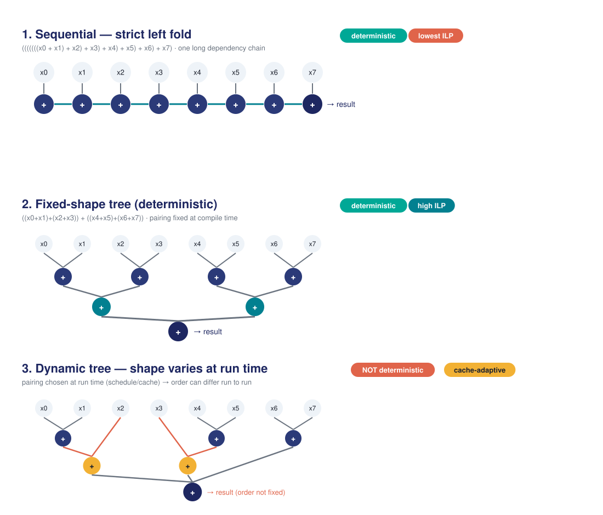

# Choosing a GEMM Tiling — by Pareto Optimisation

*A plain-language guide for C++ developers: trade-offs, dominance, and intent*

**The goal of this note.** When we tune a kernel there is rarely one "right"
configuration. There are many, each better in some respect and worse in another.
This document explains how we make that choice explicit: what **Pareto
optimisation** means, how we describe the design space, how we prune and score
it, and why the final pick is a matter of *intent* rather than a single "best."

**One caveat up front.** Pareto optimisation only helps once the objectives mean
something. In this example the initial cost model is **deliberately simple and
partly made up** — it exists to exercise the machinery. In production the same
pipeline is driven by measured or learned costs (§10 shows the first step of
that). If the cost model is wrong, the selected "optimal" plan is just the
optimum of the wrong problem — so treat the absolute numbers here as illustrative
and the *method* as the point.

---

## 1. What "Pareto" means

Suppose you are buying a car and you care about two things: **price** (cheaper is
better) and **fuel economy** (more miles per gallon is better). Some cars are
obviously bad deals: if car B is both more expensive *and* thirstier than car A,
nobody rational would pick B. We say A **dominates** B.

Now strip away every car that is dominated by some other car. What remains is a
set where you cannot improve one objective without giving up another — the
cheap-but-thirsty cars, the economical-but-pricey cars, and the sensible middles.
That set is the **Pareto frontier** (named after the economist Vilfredo Pareto).
Every car on it is a defensible choice; no car off it is.

### Dominance, precisely

With every objective written so that **lower is better**, configuration A
dominates configuration B when:

- A is *no worse* than B on **every** objective, and
- A is *strictly better* than B on **at least one** objective.

If A dominates B, then B can be discarded: A is a better choice in all respects
that matter, so there is never a reason to prefer B. A configuration that is
dominated by *no other* configuration is called **non-dominated** — it earns its
place on the frontier.

**The key consequence.** Pruning to the frontier is *objective* — it needs no
opinion about which objective matters most. But picking a single winner *from*
the frontier is *subjective* — it requires you to say what you value. We keep
those two steps strictly separate.

---

## 2. The example: choosing a GEMM tiling

Our worked example is a fused reduction kernel — think of the inner work of a
tiled **GEMM** (general matrix multiply), where a tile of the output is
accumulated from streams of input. The same tile of work can be compiled in a
great many ways, and the choices interact. We expose the choices as six
independent **dimensions**, scored against six **objectives**. (Six of each is a
coincidence — they are different lists.)

Concretely, every output element of a GEMM is a reduction over the contraction
index `k`:

```
C(i,j) = Σₖ A(i,k) · B(k,j)
```

That reduction is where all six dimensions bite. **Tiling** changes how much is
accumulated before a result is emitted; **traversal** changes the summation order
over `k` (and hence error and determinism); **register blocking** changes how
many output accumulators are live at once; **SIMD layout** changes how the
independent reductions map onto vector lanes; **unroll and prefetch** tune how
that inner loop feeds the pipeline and memory system. So although the
demonstrator focuses on the accumulation, it is the real inner kernel of a tiled
GEMM, not a generic stand-in.

### The six description dimensions

Each dimension is one axis of choice. Together they define the design space.

| Dimension | Choices | What it controls / why it matters |
|---|---|---|
| `tile_size` | 32 … 1024 | How much data one pass works on. Bigger tiles amortise loop overhead and improve reuse, but eventually overflow L1 and delay the first result. |
| `unroll` | 1, 2, 4, 8 | How many iterations are expanded inline. More unrolling hides latency and feeds the pipeline, at the cost of more live registers. |
| `traversal` | seq / fixed-shape / dynamic | The order in which partial results are combined. This is the big one: it drives both numerical error and determinism (see §3 and the diagram). |
| `prefetch` | 0, 1, 2, 4 | How far ahead we hint the hardware to fetch memory. Larger distances hide DRAM latency but waste bandwidth if mispredicted. |
| `simd` | horizontal / vertical / hybrid | How vector lanes are laid across the work. Horizontal reductions are cheap to set up; vertical exposes more parallelism; hybrid needs a minimum tile width. |
| `reg_block` | 2, 4, 8, 16 | How many accumulators are kept live at once. More blocking raises throughput until the register file spills to the stack. |

---

## 3. Traversal order: numerics and determinism (read this carefully)

The `traversal` dimension deserves its own section because two properties —
**numerical error** and **determinism** — are easy to get backwards, and the
casual intuition "sequential is the accurate, safe one" is wrong.

### Numerical error

Floating-point addition is *not* associative: the order in which you add the same
numbers changes the rounding error. A **strict left fold** (sequential)
accumulates everything into one running total, so each addition adds a small value
to an ever-growing sum — and growing sums lose low-order bits. A **balanced tree**
adds numbers of similar magnitude together first, which usually keeps the relative
error **lower**, not higher. So a tree typically has *less* error than a naive
sequential sum, the opposite of the common assumption. (A compensated sequential
sum can also be accurate, but that is a different, more expensive technique.)

### Determinism

**Determinism is about reproducibility, not accuracy.** A computation is
deterministic if it produces the bit-identical result every time you run it. The
crucial point is that **a fixed order is what gives determinism**, and there are
two ways to fix the order:

- **Strict left fold (sequential):** the order is fixed by construction — always
  left to right. Deterministic.
- **Fixed-shape (canonical) tree:** the tree shape is fixed at compile time — the
  same pairing of operands every run. Also deterministic, and it gets the better
  numerics of a tree.
- **Dynamic (runtime-scheduled) tree:** the shape is chosen at run time by cache
  state or thread scheduling, so the pairing can differ run to run. *Not*
  deterministic in general.

**So the correct statement is:** determinism comes from *order-fixity*, not from
being sequential. A fixed-shape tree is deterministic; a *general* tree is not.
This is exactly what the cost model encodes: sequential and fixed-shape tree both
score as fully deterministic (cost 0.0), while the dynamic (runtime-scheduled)
traversal is penalised.

**The three traversals, side by side:**



*Figure 1.* Reducing eight elements three ways. Sequential is one long dependency
chain (deterministic, but no parallelism). The fixed-shape tree fixes its shape at
compile time (deterministic *and* parallel, with better numerics). The dynamic
tree lets a runtime policy, cache state, or scheduling decision affect the
pairing, so its order — and therefore its exact result — can change between runs.

---

## 4. How big is the search space?

The design space is the Cartesian product of the six dimensions — every
combination of every choice:

```cpp
auto make_tile_space() {
  return descriptor_space("tile",
    power_2     ("tile_size", 32, 1024),               // 6 values
    make_int_set("unroll",    {1, 2, 4, 8}),           // 4
    make_enum_vals("traversal", {seq, fixed_tree,
                   dynamic_tree}),                     // 3
    make_int_set("prefetch",  {0, 1, 2, 4}),           // 4
    make_enum_vals("simd",    {horizontal,
                   vertical, hybrid}),                 // 3
    make_int_set("reg_block", {2, 4, 8, 16}));         // 4
}
```

That is `6 × 4 × 3 × 4 × 3 × 4 = ` **3,456 configurations**. Small enough to
enumerate here — but real kernels add dimensions fast, and the product grows
multiplicatively. A few more axes and you are in the millions, which is why
pruning matters.

---

## 5. Heuristics that shrink the space (feasibility)

Before scoring anything, we drop configurations the hardware simply cannot run.
These **feasibility heuristics** are cheap boolean tests derived from the target
machine — here a 48 KB L1, a simplified budget of 16 live accumulator registers,
AVX-512 (8 doubles per vector), and `K = 4` reductions sharing the tile. Change
the chip and the feasible set changes with it.

```cpp
if (rb*K + unroll*2 > gp_registers)        skip; // register budget
if (tile*(K+1)*sizeof(double) > L1/2)      skip; // working set fits L1
if (unroll > tile)                         skip; // can't unroll past tile
if (simd==hybrid && tile < 4*simd_width)   skip; // hybrid needs width
if (trav==dynamic_tree && tile < 128)      skip; // only pays off when big
```

**Result:** 3,456 → 468 feasible points. The other 2,988 were never going to run
on this hardware, so they cost us nothing to discard. This is also why the
framework is **great for search**: the expensive scoring only ever touches points
that are actually buildable.

---

## 6. Scoring: six objectives, all "lower is better"

**A candid note on the cost model.** The six scoring functions below are
**deliberately simple, hand-written analytical proxies** — not measured
performance and not a validated machine model. They are chosen to be *plausible
and monotonic* (bigger tiles really do cost more cache, deeper unroll really does
raise register pressure) so that the trade-offs are realistic and the search is
exercised end to end. The **point of the example is the machinery** — descriptors,
feasibility, dominance, selection — not the absolute numbers. On real hardware you
would replace these closed-form costs with measured or calibrated ones; *nothing
else in the pipeline would change*, because the frontier and selection logic only
ever see a six-number cost vector. So that the scoring is fully reproducible, here
is exactly what each function computes.

Each feasible configuration is scored on six objectives. We write every objective
so that **smaller numbers are better** — throughput and determinism are inverted
into "costs" — so the whole six-number vector can be compared uniformly. The
hardware model the formulas read is fixed: `L1 = 48 KB`, `L2 = 512 KB`,
`16 accumulator registers`, `AVX-512 (8 doubles)`, and `K = 4` reductions sharing
the tile.

### The exact scoring functions (from the repo)

```cpp
// hw = { l1=48KB, l2=512KB, line=64, gp_regs=16, simd_width=8 }, K = 4

// Objective 0 — cache miss cost  (tile_size, prefetch)
working_set = tile * K * sizeof(double);
base_rate   = working_set <= L1/2 ? 0.01
            : working_set <= L1   ? 0.05
            : working_set <= L2   ? 0.15 : 0.50;
pf_benefit  = pf > 0 ? (1.0 - 0.1*pf) : 1.0;
cache_cost  = base_rate * pf_benefit * tile;

// Objective 1 — register pressure  (reg_block, unroll)
reg_cost = rb * K + unroll * 2;

// Objective 2 — error PROXY (traversal, tile)  [crude, not a real bound]
//   sequential   -> 1.0          (naive running-sum baseline)
//   fixed_tree   -> tile * 0.01  (pairwise; smaller tile = less error)
//   dynamic_tree -> tile * 0.005 (lowest raw error per tile)

// Objective 3 — throughput cost  (tile, unroll, simd, traversal)  [inverted: lower=faster]
base        = 1000.0 / (tile * unroll);
simd_factor = horizontal ? 0.5 : hybrid ? 0.6 : 1.0;   // vertical = 1.0
tree_factor = fixed_tree ? 0.8 : sequential ? 1.5 : 1.0;  // dynamic = 1.0
thru_cost   = base * simd_factor * tree_factor;

// Objective 4 — determinism cost  (traversal)   [0 = fully reproducible]
//   sequential -> 0.0 ; fixed_tree -> 0.0 ; dynamic_tree -> 1.0

// Objective 5 — latency to first result  (tile)
lat_cost = tile;
```

**Reading the formulas.** Each is a one-line proxy for an intuition: cache cost
steps up as the working set crosses L1/L2 thresholds and is discounted by
prefetch; register cost just counts live accumulators; error is a baseline for
sequential and grows with tile for a tree (more elements summed before the
partials merge); throughput is the reciprocal of work-per-pass, scaled by how
friendly the SIMD and traversal choices are to the pipeline; determinism is a flat
penalty only for the dynamic (runtime-scheduled) traversal; latency tracks tile
size directly. One caveat worth stating plainly: the error term is a deliberately
crude scoring proxy, not a mathematical error bound — it exists only to give the
Pareto machinery something monotonic to chew on. §10 replaces it with a measured
error.

| Objective | How it is scored | Driven mainly by |
|---|---|---|
| Cache misses | Working-set size against L1/L2 thresholds, discounted by prefetch | `tile_size`, `prefetch` |
| Register pressure | Count of live accumulators plus unroll spill | `reg_block`, `unroll` |
| Numerical error | Sequential = baseline; tree error scales with tile (smaller tile = less) | `traversal`, `tile_size` |
| Throughput (cost) | Inverse of tile×unroll, adjusted for SIMD and tree parallelism | `tile_size`, `unroll`, `simd`, `traversal` |
| Determinism (cost) | 0.0 for sequential and fixed-shape tree; penalised for dynamic (runtime-scheduled) | `traversal` |
| Latency to first result | Proportional to tile size — bigger tiles delay the first output | `tile_size` |

**Why they pull against each other.** A *large tile with a balanced tree and deep
unroll* maximises throughput — but raises register pressure, lengthens latency to
first result, and (for a tree) adds a little rounding. A *small sequential tile*
is deterministic, cheap on registers, and quick to first result — but leaves most
of the throughput on the table. No single configuration can be best at
everything, which is precisely why a frontier exists.

---

## 7. Dominance in action: 468 → 33

We now apply the dominance test from §1 to all 468 feasible points. Any point
beaten by some other point on every objective is discarded. What survives is the
Pareto frontier: **33 non-dominated configurations**. These are the only
configurations worth a second look — each preserves a trade-off that no other
feasible point improves on every objective at once, so nothing beats it outright.

To make dominance concrete, compare two feasible points on (error,
throughput-cost), both lower-is-better:

| Configuration | Error | Thru-cost | Verdict |
|---|:---:|:---:|:---:|
| `tile=64, fixed-shape, unroll=4` | 0.64 | 1.56 | **on frontier** |
| `tile=64, fixed-shape, unroll=2` | 0.64 | 3.13 | **dominated** |

The second point has the *same* error but worse throughput cost, so the first
dominates it — there is no reason ever to pick the second. The filter
(`pareto_frontier` in `core/pareto.h`) does exactly this comparison pairwise
across all points, and it runs at compile time.

### Who survives — and why the fixed-shape tree dominates

It is worth looking at *which* traversals make the cut. Breaking the 33 frontier
points down by traversal order:

| Traversal | Frontier points | Why |
|---|:---:|---|
| **fixed-shape tree** | **15** | Deterministic (0.0), low error at small tiles, and the best throughput on the whole frontier at large tiles. Bad at nothing. |
| **sequential** | 9 | Deterministic and cheap on registers, but never competitive on throughput — the long dependency chain caps it. |
| **dynamic tree** | 9 | Lowest raw error per tile, but pays the determinism penalty (1.0); only survives where reproducibility is not priced in. |

**The headline:** the fixed-shape tree holds **more frontier points than either
sequential or dynamic individually — the largest single group**. It is not a
compromise you settle for — it is frequently the outright best choice, because it
is the only traversal that scores well on objectives that normally trade against
each other:

- **Determinism:** 0.0, tied with sequential for best possible. Reproducibility
  costs nothing.
- **Error:** at a small tile (0.32 at tile=32) it is *better than sequential*
  (1.00) — the naive running sum is the inaccurate one.
- **Throughput:** at a large tile it reaches the *best throughput cost on the
  entire frontier*, because the tree exposes parallelism a left-fold chain cannot.

So the fixed-shape tree gives you **tree-grade parallelism and tree-grade accuracy
with sequential-grade determinism**. Sequential can match its determinism but
never its speed; the dynamic tree can match its speed but never its determinism.
Only the fixed-shape tree sits in both good neighbourhoods — which is exactly why
fixing the tree shape (so it is *reproducible by construction*) turns a tree from
a determinism risk into the default best choice.

---

## 8. From frontier to one answer: scoring approaches

The frontier still has 33 members. To get a single kernel we apply a **selection
policy** — a rule that encodes what we value. Two policies cover almost every
case, and both are pure functions over the frontier (swapping policy never re-runs
the search).

### Lexicographic: rank the objectives

Order the objectives by priority. Compare candidates on the first; only if they
tie do you look at the second, and so on. `lex_select<4,2,3>` reads as
"determinism first, then error, then throughput." Use this when one concern
genuinely outranks the others (e.g. reproducibility is non-negotiable). Note the
result below: making determinism the top priority does *not* force you back to a
slow sequential fold — the fixed-shape tree is *equally* deterministic, so the tie
breaks on error, where the tree wins.

### Weighted: blend the objectives

Assign a weight to each objective and minimise the weighted sum.
`weighted_select(frontier, {0.15,0.15,0.20,0.25,0.15,0.10})` expresses a balanced
preference that leans slightly toward throughput and error. Use this when you want
a sensible all-round compromise rather than a strict hierarchy.

### Same code, different intent → different winner

This is the payoff. From the *identical* 33-point frontier, three policies are
applied. Notice what wins:

| Policy | Winner | Reads as |
|---|---|---|
| **Determinism > error > throughput** | `tile=32, fixed-shape tree` | reproducibility is non-negotiable — but the fixed-shape tree ties sequential on determinism and beats it on error, so the tree wins |
| **Throughput > cache** | `tile=512, fixed-shape tree` | raw speed — the fixed-shape tree at a large tile is the fastest point on the frontier, and still fully deterministic |
| **Balanced (weighted)** | `tile=32, fixed-shape tree` | a sensible compromise — the small-tile fixed-shape tree wins on cache, error, determinism and latency at once |

**All three policies pick a fixed-shape tree — and that is the point, not a
coincidence to apologise for.** The fixed-shape tree is bad at nothing, so it wins
under most reasonable intents. What still changes with intent is the **tile
size**: determinism-first and balanced choose a *small* tile (best accuracy,
cache, latency), while throughput-first chooses a *large* one (best raw speed).
Once the traversal is chosen as the fixed-shape tree, **the tile size is the real
remaining trade-off**.

**Same data. Same reductions. Same hardware. Different intent → different tile.**
That is not a defect; it is the framework being honest that "optimal" is undefined
until you state what you value — and showing that a well-chosen, reproducible
structure can be the right answer almost regardless of how you weigh the
objectives.

### What if the hardware changes?

The scoring functions and the feasibility tests both read the hardware model — L1
size, register count, vector width. Move to a chip with a bigger L1 or wider
vectors and the **same six descriptors** produce a *different feasible set, a
different frontier, and very possibly a different winner* — with no change to your
code or your policy. The intent stays fixed; the answer adapts to the machine.
Likewise, the analytical scores here can be swapped for measured or calibrated
costs without touching the dominance or selection logic.

---

## 9. Results: the demo's actual output

Everything below is produced by building and running the repo example unchanged:

```
g++ -std=c++20 -O2 -I include examples/pareto_tiling_demo.cpp -o pareto_demo
./pareto_demo
```

The funnel prints as follows. On this hardware model every frontier point shares
`prefetch=4`, `simd=horizontal`, `reg_block=2` — those three axes are pinned to
their best feasible values, so the surviving trade-offs vary only in **tile,
unroll, and traversal**. A representative slice of the 33-point frontier is shown
here; the full listing is in Appendix A.

```
Tile configuration space: 3456 points
Feasible after hardware constraints: 468
Pareto frontier size: 33
(PF=4, SIMD=horizontal, RB=2 on every frontier point)

Tile  Unr  Traversal     Cache  RegP  Error  Thru    Det
----  ---  ------------  -----  ----  -----  ------  ---
  32   1   fixed_tree     0.19  10.0  0.320  12.500  0.0   <- smallest tile: best cache/error/latency
  32   4   fixed_tree     0.19  16.0  0.320   3.125  0.0
 128   4   sequential     0.77  16.0  1.000   1.465  0.0   <- sequential: exact-order, modest speed
 128   4   dynamic_tree   0.77  16.0  0.640   0.977  1.0   <- dynamic: low error, but Det=1.0
 256   4   fixed_tree     1.54  16.0  2.560   0.391  0.0
 512   4   sequential     3.07  16.0  1.000   0.366  0.0
 512   4   fixed_tree     3.07  16.0  5.120   0.195  0.0   <- largest tile: best throughput on frontier
 512   4   dynamic_tree   3.07  16.0  2.560   0.244  1.0
   ...  (33 rows total — see Appendix A)
```

The three policy selections, verbatim:

```
Lexicographic winner (determinism > error > throughput):
  tile=32 unroll=4 traversal=fixed_tree prefetch=4 simd=horizontal reg_block=2
  cost: cache=0.19 reg=16.0 error=0.320 thru=3.125 det=0.0 lat=32.0

Lexicographic winner (throughput > cache):
  tile=512 unroll=4 traversal=fixed_tree prefetch=4 simd=horizontal reg_block=2
  cost: cache=3.07 reg=16.0 error=5.120 thru=0.195 det=0.0 lat=512.0

Weighted winner (balanced):
  tile=32 unroll=4 traversal=fixed_tree prefetch=4 simd=horizontal reg_block=2
  cost: cache=0.19 reg=16.0 error=0.320 thru=3.125 det=0.0 lat=32.0
```

**How to read the winners against the table.** Determinism-first scans for the
lowest determinism cost (0.0 — a tie between sequential and fixed-shape tree),
breaks the tie on error, where `tile=32 fixed_tree` (0.320) beats every sequential
row (1.000), then on throughput. Throughput-first instead minimises the throughput
column, landing on `tile=512 unroll=4 fixed_tree` at 0.195 — the single fastest
row — while still scoring 0.0 on determinism. The balanced weighted sum happens to
favour the same small-tile point as determinism-first. All three are fixed-shape
tree rows, which is the result §7 anticipated.

**Reproducibility.** These costs are pure `constexpr` analytical functions with no
measurement, so the frontier and the winners are **deterministic across compilers
and machines** — on ordinary IEEE-754 C++20 implementations these constexpr
analytical costs reproduce the same frontier and winners. (Figures here are from
GCC 13 at `-O2`.)

---

## 10. From estimated to observed: measuring error and speed

Sections 6 and 9 are built on the *analytical* cost model — the deliberately
simple proxies. The obvious question is whether those proxies tell the truth. For
the determinism axis the answer is by construction (a fixed shape is reproducible
or it is not). For the **error** and **throughput** axes we can do better than
assert: we can **measure**. A companion example, `examples/accuracy_probe.cpp`,
does exactly that for the three traversals.

### Method

- **Kernel under test runs in float.** the fast path that would actually ship.
- **A double Kahan sum is the high-quality reference.** it is itself only
  ~5×10⁻¹⁰ from a plain double sum — not exact arithmetic, but a trustworthy
  oracle for float-vs-double comparison.
- **The input is adversarial.** values span ~16 orders of magnitude (10⁻⁸ to 10⁸)
  with random signs, then the large terms are negated, appended and shuffled — so
  the exact sum is modest but the partial sums swing through enormous values,
  forcing catastrophic cancellation in float.
- **Timing is best-of-reps after warmup, in ns/element.** the minimum strips
  upward OS-jitter noise; a `volatile` sink defeats dead-code elimination.
- **Strict floating point — no `-ffast-math`.** letting the compiler reassociate
  would erase the experiment. (Verified: error figures are bit-identical under
  `-O2` and `-O3 -march=native`.)

### Measured results

Building and running the example unchanged:

```
cmake --build build --target accuracy_probe
./build/examples/accuracy_probe 1000000 12345 20

Accuracy + speed probe — float kernel vs double-Kahan reference
N = 1312677   seed = 12345   reps = 20   (best-of-reps timing)
Reference sum (double, Kahan) = -2.8235865064e+05   [double-Kahan reference]

float traversal         rel_error    err x |   ns/elem   time x
---------------         ---------    ----- |   -------   ------
naive sequential        7.056e-02    1.000 |     0.615    1.00x
full pairwise tree      6.380e-03    0.090 |     1.629    2.65x
blocked det. tree       8.735e-04    0.012 |     0.378    0.60x
Kahan sequential        6.336e-04    0.009 |     2.486    4.04x
```

Reading the rows against each other tells the whole story of the error/throughput
trade-off — now with observed numbers in place of the proxies. (The blocked
deterministic tree recurses down to a small block, then sums that block
straight-line; the full tree pairs all the way down.)

| Traversal | Error vs naive | Speed vs naive | Character |
|---|:---:|:---:|---|
| `naive sequential` | 1× (baseline) | 1.00× | simple baseline; catastrophically inaccurate here, and slower than the blocked tree on this workload |
| `full pairwise tree` | ~10× better | ~2.6× slower | clean pairwise reference shape; accurate, but this recursive implementation's overhead dominates |
| **`blocked det. tree`** | **10–100× better** | **~0.6× (faster)** | **fast AND far more accurate than naive; near full-tree** |
| `Kahan sequential` | ~100× better | ~4.0× slower | most accurate, slowest |

### What the timing revealed

The **blocked deterministic tree** is the one to notice. It recurses pairwise down
to a small block (here ~64 elements), then sums that block as a tight
straight-line loop. Against the naive float baseline it is **both faster (~0.6× the
time of naive — i.e. about 1.6× the throughput) and one-to-three orders of
magnitude more accurate** — a genuine dual win over naive sequential, on both axes
at once, and stable across every seed.

**Why blocking helps speed.** This is the key mechanism, and it is what makes
blocking worthwhile: the straight-line block exposes **instruction-level
parallelism and vectorisation**. Independent partials within and across blocks
break the single long dependency chain of a sequential fold, so the pipeline can
overlap work and the compiler can use SIMD lanes. This full recursive tree
implementation, by contrast, pays a real ~2.6× penalty for per-element recursion
overhead (an iterative or vectorised pairwise tree need not) — which is exactly
the trap behind the "trees are slow" folklore. Blocking removes that penalty while
keeping the tree's fixed, deterministic shape.

**An honest note on accuracy.** Blocking does *not* improve accuracy over a full
pairwise tree — if anything it gives a little back, because each block is summed
sequentially inside. Measured across seeds, the blocked tree lands **close to the
full tree**, sometimes a little better and sometimes a little worse depending on
the input; neither dominates. What is robust is that the blocked tree is **vastly
more accurate than the naive sequential sum** (10×–1000× across seeds) while also
being faster than it. So the accuracy claim is "near full-tree, far above naive,"
not "best of all." Top accuracy still belongs to Kahan, at the highest cost.

**This is the measured vindication of §7.** The analytical model *predicted* a
deterministic tree would dominate the frontier; the measurement *confirms* that a
blocked deterministic tree beats the naive sequential baseline on accuracy and
speed simultaneously while remaining fully reproducible — refuting both "trees are
slow" (blocking + ILP makes it the fastest of the accurate options) and "trees are
inaccurate" (it is 10×–1000× better than the naive sum). The block size and the
intra-block strategy are themselves a speed/accuracy dial — precisely the kind of
choice the Pareto search exists to make.

### What this measurement can and cannot claim

Two honest boundaries. First, this measures error under *adversarial* cancellation;
on benign, well-conditioned data the accuracy gaps shrink toward floating-point
noise and the choice is driven by speed alone. The point is not that the tree
always wins on accuracy, but that **when accuracy matters, the fixed-shape tree is
measurably the better-behaved structure**. Second — and usefully — this experiment
needs **no hardware performance counters**: it is pure arithmetic against a
reference plus wall-clock timing, so it reproduces anywhere, including CI and
virtual machines where `perf_event_open` is unavailable. The cache-miss and IPC
objectives from §6 *do* require a PMU-enabled host; error and throughput do not.
That makes this the most portable of the "observe the objectives" techniques, and
the right one to lead with.

**Plugging measured costs back in.** Because the frontier and selection logic only
ever consume a six-number cost vector, these observed error and timing numbers can
replace the `error_bound_cost` and `throughput_cost` proxies directly — the
dominance test, the `lex_select` / `weighted_select` policies, and the rest of the
pipeline are unchanged. That is the whole point of keeping the cost model
pluggable: **we guess to prune, then measure to decide**.

---

## 11. Takeaways for a C++ developer

- **Pareto = honest trade-offs.** Dominance objectively removes the bad choices;
  it never picks a favourite among the good ones.
- **Describe the space, don't hand-tune it.** Six typed dimensions replace a wall
  of hand-written kernel variants.
- **Determinism is order-fixity.** Sequential and fixed-shape tree are both
  deterministic; a general tree is not. A tree can also have lower error than a
  sequential sum.
- **Prune before you score.** Cheap feasibility tests keep expensive scoring off
  configurations that could never run.
- **Intent lives in the policy.** Change the weighting, the priority order, or the
  hardware, and the chosen kernel changes — your code does not. Here every
  reasonable policy picks a fixed-shape tree; what intent decides is the *tile
  size*.
- **A good structure wins broadly.** The fixed-shape tree holds 15 of the 33
  frontier points — more than either sequential or dynamic individually, and the
  largest single group on the frontier — because it is bad at nothing. A
  reproducible-by-construction structure can be the right answer almost regardless
  of how you weigh the objectives.
- **Guess to prune, measure to decide.** The analytical model honestly narrows the
  space; for the objectives that matter most you then measure. A blocked
  deterministic tree was *measured* at 10×–1000× the accuracy of a naive float sum
  in about 40% less time (roughly 1.6× the throughput) — a dual win over the naive
  baseline, near full-tree accuracy, and reproducible without hardware counters
  because blocking enables ILP/SIMD.
- **Zero overhead.** The whole search is constexpr; the binary carries only the
  chosen plan, compiled to one straight-line path.

---

## Appendix A: the full 33-point frontier

The complete non-dominated set printed by `pareto_tiling_demo` (all costs
lower-is-better; every row has `PF=4, SIMD=horizontal, RB=2`):

```
Tile  Unr  Traversal     Cache  RegP  Error   Thru    Det
----  ---  ------------  -----  ----  ------  ------  ---
  32   1   fixed_tree     0.19  10.0   0.320  12.500  0.0
  32   2   fixed_tree     0.19  12.0   0.320   6.250  0.0
  32   4   fixed_tree     0.19  16.0   0.320   3.125  0.0
  64   1   fixed_tree     0.38  10.0   0.640   6.250  0.0
  64   2   fixed_tree     0.38  12.0   0.640   3.125  0.0
  64   4   fixed_tree     0.38  16.0   0.640   1.562  0.0
 128   1   sequential     0.77  10.0   1.000   5.859  0.0
 128   1   fixed_tree     0.77  10.0   1.280   3.125  0.0
 128   1   dynamic_tree   0.77  10.0   0.640   3.906  1.0
 128   2   sequential     0.77  12.0   1.000   2.930  0.0
 128   2   fixed_tree     0.77  12.0   1.280   1.562  0.0
 128   2   dynamic_tree   0.77  12.0   0.640   1.953  1.0
 128   4   sequential     0.77  16.0   1.000   1.465  0.0
 128   4   fixed_tree     0.77  16.0   1.280   0.781  0.0
 128   4   dynamic_tree   0.77  16.0   0.640   0.977  1.0
 256   1   sequential     1.54  10.0   1.000   2.930  0.0
 256   1   fixed_tree     1.54  10.0   2.560   1.562  0.0
 256   1   dynamic_tree   1.54  10.0   1.280   1.953  1.0
 256   2   sequential     1.54  12.0   1.000   1.465  0.0
 256   2   fixed_tree     1.54  12.0   2.560   0.781  0.0
 256   2   dynamic_tree   1.54  12.0   1.280   0.977  1.0
 256   4   sequential     1.54  16.0   1.000   0.732  0.0
 256   4   fixed_tree     1.54  16.0   2.560   0.391  0.0
 256   4   dynamic_tree   1.54  16.0   1.280   0.488  1.0
 512   1   sequential     3.07  10.0   1.000   1.465  0.0
 512   1   fixed_tree     3.07  10.0   5.120   0.781  0.0
 512   1   dynamic_tree   3.07  10.0   2.560   0.977  1.0
 512   2   sequential     3.07  12.0   1.000   0.732  0.0
 512   2   fixed_tree     3.07  12.0   5.120   0.391  0.0
 512   2   dynamic_tree   3.07  12.0   2.560   0.488  1.0
 512   4   sequential     3.07  16.0   1.000   0.366  0.0
 512   4   fixed_tree     3.07  16.0   5.120   0.195  0.0
 512   4   dynamic_tree   3.07  16.0   2.560   0.244  1.0
```

---

*Sources: `examples/pareto_tiling_demo.cpp`, `examples/accuracy_probe.cpp` ·
tuple_algebra (CT-DP framework) · figures from live CMake builds (GCC 13)*
